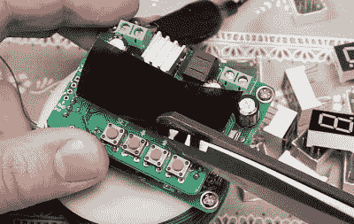

# 快速提示提高七段 LED 可见度

> 原文：<https://hackaday.com/2022/06/03/quick-tip-improves-seven-segment-led-visibility/>

我们喜欢在这些地方安装漂亮的七段 LED 显示屏，从它们出现在我们项目中的频率来看，社区似乎也很喜欢它们。但是，尽管它们便宜，易于使用，并散发出所有重要的复古气息，它们肯定不是完美的。首先，在某些光线条件下，它们的可见度很低，尤其是当你为了记录而试图拍摄它们的时候。

The tint film can be cut to size once applied.

如果这是你最近遇到的一个问题，[【Hugatry】有一个简单的提示](https://www.youtube.com/watch?v=kd45sQ0I-34)可以帮你解决一些麻烦。用汽车车窗着色材料的碎片，很容易切割出可以直接应用到显示器表面的自定义滤镜。正如在视频中看到的，改进是非常显著的。这些数字以前几乎不可见，但由于色彩的对比，它们在新变暗的背景下显得明亮而美丽。

[Hugatry]在这次演示中使用了 5%的着色胶片，因为他手头上已经有了这种胶片，但是您可能希望根据您最有可能阅读显示屏的环境光线水平来试验不同的值。这些东西当然足够便宜，可以拿来玩——快速检查一下就可以发现，花 10 美元，你就可以买到足够看几百场电影的胶卷。根据项目的不同，[并不像你想象的那样过分。](https://hackaday.com/2019/12/20/movie-style-hacking-with-a-wall-of-glowing-hex/)

 [https://www.youtube.com/embed/kd45sQ0I-34?version=3&rel=1&showsearch=0&showinfo=1&iv_load_policy=1&fs=1&hl=en-US&autohide=2&wmode=transparent](https://www.youtube.com/embed/kd45sQ0I-34?version=3&rel=1&showsearch=0&showinfo=1&iv_load_policy=1&fs=1&hl=en-US&autohide=2&wmode=transparent)

