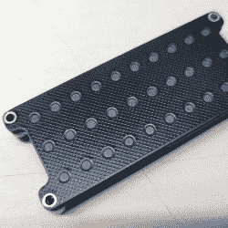

# DIY 键盘不能再小了

> 原文：<https://hackaday.com/2022/06/04/diy-keyboard-cant-get-much-smaller/>

这个 [PiPi Mherkin](https://www.40percent.club/2021/10/pipi-mherkin.html) 真的真的不能再小了。小巧的键盘设计直接安装在负责驱动它的 Pi Pico 上，具有类似的占地面积，厚度只有约 9 毫米。它不能再小了，因为它已经和 Pi Pico 一样小了。

运行在 Pi Pico 上的  是 [PRK 固件](https://github.com/picoruby/prk_firmware)，这是一个键盘框架，使设备看起来像一个 USB 外设，很好地检查了“正常工作”框。这里的按钮看起来有点凹陷，但使用的开关有更高的格式，所以这只是一个偏好的问题。

我们不得不承认这个东西有一个非常干净的外观，但在如此小的尺寸下，我们同意它可能更像一个紧凑的 macropad，而不是一个实际的功能键盘。不过，它可能会在正确的项目中找到一席之地。如果你感兴趣的话，设计文件在线。

如果你喜欢小巧紧凑的键盘，但更喜欢普通大小的按键，请看看 PiPi Mherkin 的老大哥[PiPi Gherkin](https://hackaday.com/2021/06/09/tiny-mechanical-keyboard-powered-by-pi-pico/)，它聪明地使用双功能轻敲/按住键，只需 30 个键就能提供完整的功能，最大限度地减少麻烦。

毕竟，键盘很重要，值得认真对待，[我们自己的【Kristina Panos】非常清楚](https://hackaday.com/series_of_posts/keebin-with-kristina/)。