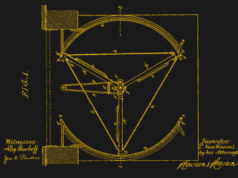
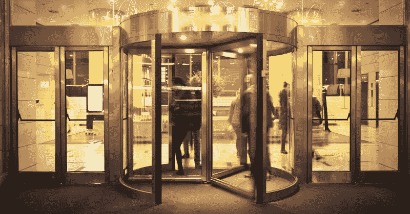
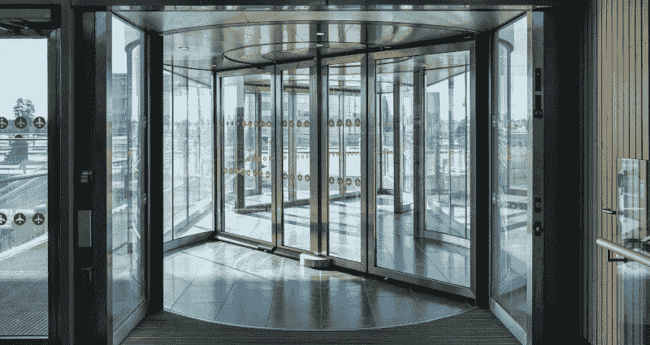

# 旋转门不仅烦人，而且节能

> 原文：<https://hackaday.com/2022/06/09/revolving-doors-arent-just-annoying-theyre-energy-saving-too/>

虽然我们中的大多数人已经满足于使用旋转门和滑动门来满足家里的绝大多数需求，但旋转门在各种场合仍然很受欢迎。

这是一个令人困惑的装置，总是感觉随时准备抢夺和诱捕粗心的用户。然而，这些门确实有一定的好处，使它们在世界各地的许多公共建筑中保持流行。下面让我们深入探讨一下为什么。

## 你让我团团转

A drawing from the 1888 patent filing of Theophilus Van Kannel for a “storm-door structure.” In the 19th century, Van Kannel was keenly aware of the benefits of keeping the weather out. Credit: [Patent filing, public domain](https://en.wikipedia.org/wiki/Revolving_door#/media/File:PatentzeichnungStormDoor.jpg)

旋转门可以追溯到 19 世纪末，大约在那个时候有两项主要的专利申请。德国的 h .博克在 1881 年申请了一项旋转圆柱形门的专利。与此同时，更著名的提阿非罗·范·坎内尔在 1888 年获得了一项专利，他发明了一种具有我们今天所熟悉的所有主要特征的三层旋转门。

这两位发明家都敏锐地意识到这种设计的好处。他们的旋转门旨在允许进出建筑物而不需要过多的空气交换。除非用在双级气闸设计中，否则旋转门和滑动门能够使风和雨容易地进入建筑物。相比之下，边缘密封的旋转门几乎完全避免了这种情况。当门的每一部分旋转时，只有一小部分空气被交换。更好的是，设计合理的旋转门不会被风吹开，并且允许人们同时进出大楼。这些好处导致许多公共建筑采用旋转门。

事实上，由于空气交换量较低，旋转门已成为许多摩天大楼的一个关键特征。这些较高的建筑受到所谓的“烟囱效应”的影响随着建筑的暖通空调系统加热室内空气，这种温暖的空气随着浮力的增加而上升。这就在建筑物的底部产生了一个低压差。当旋转门在地面打开时，会导致空气涌入。这就迫使热空气依次从建筑物顶部排出。这种微风让居住者感到沮丧，也不利于效率，因为新鲜空气必须再次加热，使用更多的能量。当较冷的空气以相反的方向穿过建筑物时，同样的效应也会发生在较温暖的月份。

Whether built in a 3- or 4-leaf design, revolving doors create a useful airlock that prevents excessive air exchange with the outside world. This allows for greater comfort inside, protects the ground floor from weather, and improves energy efficiency.

旋转门的自然密封设计避免了这个问题。虽然这种门的密封性不如普通关闭的摆动门，但与反复打开和关闭的摆动门相比，它在工作时交换的空气要少得多。即使在较小的建筑中，这种影响也是显而易见的。更容易受到烟囱效应影响的较大建筑，具有更大的压差，将注意到明显更大的好处。

麻省理工学院在 2006 年进行的一项简单研究发现旋转门的好处可能是深远的。据估计，仅在一栋建筑中使用旋转门就可以节省目前每年供暖能耗的 74%,减少 15 吨二氧化碳排放。

Some folding doors feature segmented designs  that allows the doors themselves to be folded out of the way. This can be useful for bringing long or large objects through the door, or for maximizing throughput in emergency events.

然而，这确实凸显了旋转门的一个缺陷。为了获得好处，旋转门必须优先于摆动式门使用。即使在有旋转门入口的建筑中，许多[建筑规范](https://www.ontario.ca/laws/regulation/r06350)要求也要有旋转门。这通常是明智的做法，因为旋转门在紧急情况下可能是一种负担，容易被突然冲向出口的人群堵塞或淹没。然而，如果人们经常使用旋转门，而不是旋转门，这一点也不节能。

旋转门经常让忙碌的人感到沮丧，这是一个简单的事实。它们不常出现在动作片里是有原因的——毕竟，很难在一瞬间看完一部。手动推动式可以让人们快速通过，但速度必须受到机械限制，以避免伤害同时通过门的其他人。或者，自动门可以以恒定的速度转动，但它们通常必须相对较慢，以便那些不像其他人那样移动和快速的人能够进入。还必须为轮椅使用者和使用其他助行器的人提供适当的通道。

总的来说，旋转门在我们的建筑中扮演着重要的角色。它们可能很慢，令人沮丧，特别是当自动的随机停止时(看着你，宜家)，但它们可以为我们节省大量的能源账单。在我们需要尽可能提高效率的时候，这对气候也有好处。