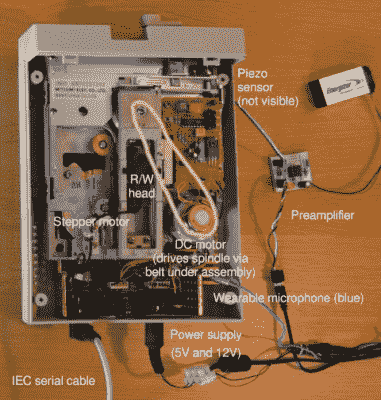

# 现场音乐为任何活动增添了优雅

> 原文：<https://hackaday.com/2022/06/09/live-floppy-music-adds-elegance-to-any-event/>

在早期人类开始敲打石头后不久，部落中有人认为他们可以通过一点节奏来改进事情。就这样，第一个音乐家诞生了，而且因为人类发现如何记录声音还需要几百万年，所以在历史上的大部分时间里，音乐表演都必须现场体验。从宇宙的角度来看，Spotify 只在午夜狂欢前一秒钟出现。

因此，唯一合适的是[【莱纳斯·奥克森】已经将音乐软盘驱动器](https://linusakesson.net/music/partita-prelude/index.php)完善到现在可以现场播放的程度。我们理解这一点通过休息下的视频演示的讽刺性，但我们认为它仍然能够表达这一点——而不是必须让一系列精心编写的驱动器来执行甚至接近音乐数字的东西，他能够通过实时操纵单个驱动器来产生音调。

 在他的文章中，[Linus]不仅讲述了用软驱制作音乐的基本细节，还具体解释了这款 Commodore 1541-II 驱动器是如何被改造以适应其作为数字艺术大师的新生活的。从他的实验来确定哪些驱动器移动对应于最悦耳的声音，到添加一个小型麦克风和一个压电传感器，与一个基于 LMC662 的放大器配对，以提供对驱动器声音和振动的高保真捕捉，这里有许多有价值的信息，可供其他人使用他们的旧设备制作一些甜美的音乐。

今年我们已经看到了软驱的复苏，[像 Adafruit 这样的人挖掘经典存储介质](https://hackaday.com/2022/01/31/floppy-interfacing-hack-chat-with-adafruit/)，以及一个实验项目[允许 Arduino IDE 创建可引导的 x86 软盘](https://hackaday.com/2022/01/12/arduino-ide-creates-bootable-x86-floppy-disks/)。你不会听到我们的任何抱怨——尽管与更现代的技术相比，它们可能不会提供太多的容量，但一堆匆忙贴上标签的多色磁盘却温暖了我们冰冷的机器人心脏。

 [https://www.youtube.com/embed/mbhQ36bd870?version=3&rel=1&showsearch=0&showinfo=1&iv_load_policy=1&fs=1&hl=en-US&autohide=2&wmode=transparent](https://www.youtube.com/embed/mbhQ36bd870?version=3&rel=1&showsearch=0&showinfo=1&iv_load_policy=1&fs=1&hl=en-US&autohide=2&wmode=transparent)

