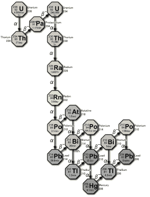
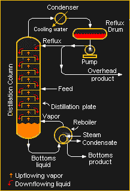

# 采矿和提炼:氦

> 原文：<https://hackaday.com/2022/06/15/mining-and-refining-helium/>

每天都有看似无穷无尽的基本物品短缺列表出现在新闻提要中，如果你没有注意到任何一个特定的短缺，那也是情有可原的。但在从鸡蛋到化肥到沙拉沙司的各种短缺中，人们越来越意识到，我们可能实际上正在耗尽一种如此基本的东西，这种东西可能会对我们科技社会的各个方面产生影响:氦。

氦在日常生活的几乎每一个方面都至关重要，这一点很难夸大。氦的独特性质，比如它在绝对零度以上几度仍保持液态的事实，有助于它在无数工业过程中的应用。从检漏和焊接到硅片生产和冷却使磁共振成像成为可能的超导磁体，氦已经在技术中根深蒂固，掩盖了它的相对稀缺。

但是氦从哪里来呢？正如我们将会看到的，元素周期表中第二轻的元素并不容易得到，人们花费了大量的精力来提取和提纯它以满足工业用途。虽然在改进提取方法和发现新矿床方面取得了很大进展，但实际上氦是一种不可再生的资源，没有替代品。所以知道一两件关于我们如何得到它的事情是值得的。

## 腐烂的产物

尽管氦是可见宇宙中第二丰富的元素，但它在地球上出奇的稀少。虽然在 19 世纪 60 年代首次在太阳和其他恒星的光谱图中发现了氦，但要获得足够的氦来研究并确定它是一种元素，还需要再等 30 年，那时通过将铀矿样品溶解在酸中，会释放出具有相同光谱特征的气体。

Uranium decay series. When U-238 decays into Th-234 (upper left), it liberates an alpha particle, which is a helium nucleus. The particle quickly picks up two electrons, creating a new atom of helium. Source: [Tosaka](https://commons.wikimedia.org/wiki/File:Decay_chain(4n%2B2,_Uranium_series).PNG), [CC BY 3.0](https://creativecommons.org/licenses/by/3.0), via Wikimedia Commons

在地球上发现氦是在化学史上的一个有利时机。19 世纪末和 20 世纪初，化学的焦点从涉及整个原子的反应扩展到亚原子领域，在组成原子的电子、质子和中子的水平上。人们刚刚开始探索放射性，在首次分离出氦的时候，人们就已经知道了α、β和γ射线的存在。因此，当卢瑟福和博伊德发现阿尔法射线实际上是由两个质子和两个中子组成的粒子，这与氦原子的原子核相同时，它立即提出了氦如何被捕获在铀矿石中的机制。

像所有重放射性元素一样，铀沿着一系列特定的元素衰变。铀系列从同位素 ^(238) U 开始，这是铀的天然存在且相对丰富的同位素。 ^(238) 铀的半衰期约为 40 亿年，当它衰变时，它会释放出一个阿尔法粒子。失去一对质子和一对中子会将 T4 238 变成钍 234。被释放的阿尔法粒子实际上是一个氦核，当它被几乎任何遇到的物质吸收时，很容易吸收两个电子，产生一个氦原子。

这很好地解释了为什么氦存在于铀矿样本中——随着时间的推移，铀衰变释放出阿尔法粒子，这些粒子被岩石吸收，获得成为氦原子所需的电子。氦随着时间的推移积累，聚集在岩石的孔隙中，直到岩石中的矿物质最终溶解时才释放出来。同样的过程，尽管是在地质尺度上，却是工业氦生产的关键。

## 气体中的气体

与大多数工业气体不同，氦气在大气中的浓度并不高。任何在产生后没有以某种方式隔离的氦都会进入大气层，并很快消失，迅速上升到高层大气，最终进入太空。因此，像我们从空气中分离氧气、氮气、氩气和其他气体那样分离氦气是不切实际的。相反，我们需要在脚下寻找大量的氦储藏。

幸运的是，倾向于将天然气截留在地下储层中的相同地质条件也倾向于截留氦，因此天然气井是氦的最大来源。历史上，美国一直是世界市场氦气的主要供应国，大部分来自俄克拉荷马州、堪萨斯州和德克萨斯州的天然气井。在这里，从地下开采出来的气体中氦的含量高达 7%，这对于有利可图的开采来说绰绰有余。

天然气是甲烷、氮气、二氧化碳和乙烷、丙烷等高级气态烷烃的混合物。当掺入足够的氦气时——任何超过 0.4%的氦气都被认为是有利可图的——氦气的提取和提纯是通过分馏进行的。氦是所有元素中沸点最低的，这意味着通过降低温度和控制压力，可以隔离其他所有气体。

氦气生产的第一步是从天然气中去除一氧化碳和硫化氢。这是在胺处理器中完成的，其中化学单乙醇胺(MEA)被喷入反应容器内的气流中。MEA 将酸性化合物离子化，使其溶于水，从而将它们从天然气中洗去。洗涤后的气体通过分子筛如沸石和活性炭床进一步预处理，以除去水蒸气和任何较重的烃。

Schematic of a generic industrial distillation process. Source: [H Padlekas](https://en.wikipedia.org/wiki/Fractional_distillation), CC-BY-3.0

经过这些预处理步骤后剩下的主要是甲烷和氮气，但也有一些氖和氦。气体通过热交换器冷却，然后通过膨胀阀进入折流板分馏塔。压力的突然下降使气体的温度降低到足以使沸点为-161.5℃的甲烷冷凝成液体并排到塔底。

剩余的气体，现在主要是氮气和氦气，通过冷凝器进一步冷却气流。当混合物的温度降到-195.8℃以下时，氮气冷凝成液体。与液态甲烷一起，液氮通过管道输送到热交换器，该热交换器最初用于冷却进入的预处理工艺气体。现在气态的氮和甲烷，两者都是有价值的产品，通过管道输送到储存罐。

剩余的过程气体中大约有一半是氦气，其余的是污染的甲烷和氮气的混合物，还有少量的氢气和氖气。这种混合物被称为冷粗氦，现在必须经过进一步的提纯才能达到工业应用所需的纯度。净化从另一个热交换器开始，该热交换器将粗氦混合物降到氮的沸点以下，以冷凝出剩余的氮和甲烷污染物。这一步将粗氦的纯度提高到 90%左右。

## 最终净化

为了除去氢气，引入氧气，并在催化剂的存在下加热混合物。氢气和氧气形成水，水可以在工艺气流通过变压吸附或 PSA 进行最终净化之前从工艺气流中分离出来。变压吸附与氧气浓缩器中使用的过程相同，包括许多 DIY 版本,我们已经看到这是对新冠肺炎的回应。PSA 利用被称为分子筛的材料选择性吸附气体的能力。在氦气提纯中，纯度为 90%的气体被泵入装有分子筛(通常是沸石)的压力容器中。污染气体优先被吸附到沸石中，使输出气流接近纯氦。当第一个色谱柱被污染物饱和时，液流被切换到第二个色谱柱，该色谱柱之前已经用纯氦进行了回洗再生。气流在两个柱之间来回切换，一个净化氦气，另一个再生氦气。结果是纯度为 99.995%的气态 A 级氦。

此处描述的工艺绝不是从天然气中提取氦气的唯一方法，但它确实代表了生产这种气体的最常见方法，主要是因为大多数预处理和初始净化步骤已经用于处理天然气作为燃料和化学工业的原料。其他方法包括[一个完全变压吸附过程](https://www.researchgate.net/publication/236882400_Purification_of_helium_from_natural_gas_by_pressure_swing_adsorption)，它可以使用氦浓度仅为 0.06%的天然气，以及膜分离，它依赖于氦比大得多的甲烷和氮分子更容易穿透半透膜这一事实。膜分离技术比传统的分馏更节能，因为它不需要相变和所需的能量。

 [https://www.youtube.com/embed/WjX5HBSQGxM?version=3&rel=1&showsearch=0&showinfo=1&iv_load_policy=1&fs=1&hl=en-US&autohide=2&wmode=transparent](https://www.youtube.com/embed/WjX5HBSQGxM?version=3&rel=1&showsearch=0&showinfo=1&iv_load_policy=1&fs=1&hl=en-US&autohide=2&wmode=transparent)

## 但是我们用完了吗？

知道了地球岩石圈中铀-238 的丰度及其半衰期，就有可能估计放射性过程中产生的氦的量。事实证明数量并不多——每年只有大约 3000 公吨。几乎所有的二氧化碳都逃逸到大气和太空中。因此，与通常发现氦的天然气一样，氦实际上是一种不可再生资源。

但这是否意味着我们快用完了呢？是的，就像任何其他有限的资源一样，最终我们会提取所有可提取的资源。但这并不意味着我们已经找到了所有的氦。勘探在美国带来了新的矿藏，在阿尔及利亚等地也发现了大量的氦。2000 年代初，阿尔及利亚成为世界第二大氦生产国。卡塔尔在 2013 年也发现了巨大的氦，使其上升到世界第二位。这些发现，加上最近在南非发现的氦含量高达 12%的天然气井，有望解决人们对失去这种不可替代的气体的一些担忧。

 [https://www.youtube.com/embed/2DtOzH9YseQ?version=3&rel=1&showsearch=0&showinfo=1&iv_load_policy=1&fs=1&hl=en-US&autohide=2&wmode=transparent](https://www.youtube.com/embed/2DtOzH9YseQ?version=3&rel=1&showsearch=0&showinfo=1&iv_load_policy=1&fs=1&hl=en-US&autohide=2&wmode=transparent)

但是到了最后，这些新发现只是把时钟推了回去，阻止了氦最终耗尽的不可避免的一天。如果商业规模的核聚变成为现实，我们可能会有所突破，但在过去的 80 年里，这一突破“只有 20 年之遥”。