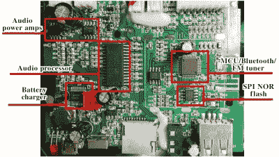

# 通过固件模式驯化的蓝牙扬声器

> 原文：<https://hackaday.com/2022/06/13/bluetooth-speaker-domesticated-through-firmware-mod/>

这听起来可能是一个熟悉的问题——你有一个蓝牙扬声器，听起来很好，但它也会不时发出各种奇怪的声音。[Oleg Kutkov]给自己买了一个带 FM 收音机功能的 Sven PS460 扬声器，但不喜欢“开机”声音持续很大，不考虑音量设置，以及低电量通知声音令人讨厌。于是，他拆卸了扬声器，在处理器旁边放了一个闪存芯片，[开始黑客攻击。](https://olegkutkov.me/2021/02/27/hacking-a-firmware-of-bluetooth-speaker-fm-radio/)

 用一个 TL866 和`minipro`软件，他把固件甩了，开始用`binwalk`探测。默认的一组选项没有显示任何有趣的东西，但是他决定专门寻找声音文件签名，并成功地找到了一个 MP3 文件集！正确提取这些内容有点棘手，但他找到了如何提取它们的方法，并将整个分类加载到 Audacity 中。

从那时起，他决定只是让恼人的声音更安静——在某种程度上否定“不尊重音量设置”这一方面。在 Audacity 导出声音包后，文件明显变小了，所以他对其进行了零填充，最后将其重新插入固件。测试表明，它正如预期的那样工作！作为奖励，他用我们大多数人都喜欢的东西代替了“电池电量低”的指示音。请查看他的文章末尾的演示视频。

驯化你的蓝牙扬声器往往是需要的。如果你因为某种原因无法做到这一点，你可以[将它们改造成一个音频接收器](https://hackaday.com/2018/07/23/turn-a-cheap-bluetooth-speaker-into-an-audio-receiver/)——或者，也许，建造你自己的蓝牙扬声器，从一开始就包含[美学，忽略烦恼。](https://hackaday.com/2020/07/30/aesthetic-diy-bluetooth-speakers/)