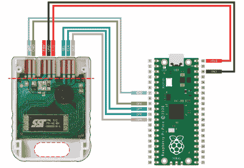

# 树莓派 Pico 取代 PlayStation 存储卡

> 原文：<https://hackaday.com/2022/06/13/raspberry-pi-pico-replaces-playstation-memory-card/>

现在几乎很难相信，现代游戏控制台的内部存储容量高达数兆字节，但曾经有一段时间，你的整个游戏生涯都存储在一个只能保存几兆字节数据的外部存储卡上。当然，在此之前，你必须写下一系列随机的字母和数字，从你停止的地方开始，但这是另外一个故事。

虽然存储卡的概念对现代游戏玩家来说可能是古怪的，但它的模块化性质确实为黑客提供了一些有趣的探索途径。例如，[看看【Daniele giulia ni】](https://github.com/dangiu/PicoMemcard)非常令人印象深刻的 PicoMemcard 项目。就硬件而言，没有比这更简单的了。你只需从廉价(或废弃)的 PlayStation 存储卡上取下 PCB，将七根跳线焊接到 edge 连接器触点上，就可以将它们插入 Pico。然后你只需将固件上传到 Pico，就大功告成了。

 那么你为自己的烦恼得到了什么？首先，一个功能齐全的 PlayStation 存储卡。但更重要的是，一个带 USB 接口的存储卡可以让你将保存的游戏备份到电脑上。

当然，你也可以从电脑上写新的保存文件到 Pico 中，这提供了各种可能性。正如我们过去所报道的，有[正在努力利用 PlayStation 的版权保护系统](https://hackaday.com/2021/04/10/newest-playstation-exploit-skips-the-disc/)使用[精心制作的保存游戏](https://hackaday.com/2021/03/15/playstation-unlocked-with-new-software-hack/)。PicoMemcard 将允许您在自己的控制台上轻松获得这些保存，让您可以加入到乐趣中。

不想废弃现有的存储卡？[Daniele]正在开发一种定制的 PCB，它实现了一种合适的边缘连接器，这意味着您将不再需要牺牲卡。虽然目前尚未实现，但电路板设计还包括一个 SD 插槽，最终将允许 PicoMemcard 存储更多数据。如果这么多年过去了，你还在玩最初的 PlayStation，我们强烈建议你订购一台 Pi Pico，并关注这个项目。我们也向所有游戏迷推荐同样的东西。

 [https://www.youtube.com/embed/Sie0kzmnJJw?version=3&rel=1&showsearch=0&showinfo=1&iv_load_policy=1&fs=1&hl=en-US&autohide=2&wmode=transparent](https://www.youtube.com/embed/Sie0kzmnJJw?version=3&rel=1&showsearch=0&showinfo=1&iv_load_policy=1&fs=1&hl=en-US&autohide=2&wmode=transparent)

感谢[安德里亚·坎帕内拉]的提示。