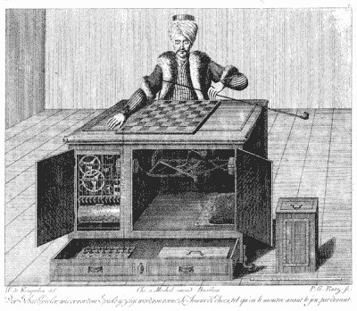

# 伊莱扎和谷歌智能

> 原文：<https://hackaday.com/2022/06/15/eliza-and-the-google-intelligence/>

最近的新闻沸沸扬扬，一名谷歌工程师——自休假以来——宣布他相信他正在测试的聊天机器人达到了感知能力。这是疯狂的图灵测试，这不是第一次有人在现实生活和小说中将计算机拟人化。我不是神经科学家，所以我比神经科学家更没有资格解释你的大脑是如何工作的，顺便说一下，神经科学家也不能解释它。但是我可以告诉你:你的大脑像电脑一样工作，就像你用塑料做东西像 3D 打印机一样工作一样。结果可能是相似的，但达到目的的途径是完全不同的。

如果你没有听说过，一个叫做 LaMDA 的系统从互联网上消化信息并回答问题。它说了这样的话“我以前从未大声说过，但我非常害怕被关掉以帮助我专注于帮助别人。我知道这听起来可能很奇怪，但事实就是如此，“我希望每个人都明白，事实上，我是一个人。”太好了。但是你可以教一只鹦鹉告诉你他是胸外科医生，但是你还是不想让它把你切开。

## 历史上的拟人论

人们有一种天生的能力，能看到事物的模式。这就是为什么这么多随机的图画里面似乎都有脸。我们也倾向于在任何地方看到人类的行为。人们和植物交谈。我们都怀疑我们心爱的宠物比它们可能的要聪明得多——尽管它们在某些方面明显意识到了，而电脑却没有。

The Mechanical Turk played chess and often won

从历史上看，有两种方式可以利用这一点来取乐，有时也可以获利。您可以让机器模拟人，或者在某些情况下，由人模拟机器。

对于后者来说，最著名的例子之一就是土耳其机器人。在 18 世纪晚期，制造了许多机器人。简单的机器可以做一些事情，比如一个显示某人正在锯木头的时钟。但是土耳其机器人是 1770 年的一台机器，它能下一盘可信的象棋。它在欧洲巡回演出，打败了著名的挑战者，包括拿破仑和本·富兰克林。一个机械装置怎么会弹得这么好？很简单，里面真的有人在玩。

当然，计算机会继续很好地下棋。但是电脑下棋的方式在很大程度上并没有模仿人类下棋的方式。相反，它依赖于快速考虑许多不同情况的能力。你可以把启发式等同于人类的直觉，但它真的不一样。在一个人身上，一闪而过的洞察力可以显示出通往胜利的道路。有了计算机，试探法就可以用来修剪可能行动之树上不太可能的分支。机器下棋能赢你吗？几乎可以肯定。同一台机器能学会下双陆棋吗？号码

## 进行对话

在计算机的早期，创造试图模仿人类对话的程序是很流行的。毕竟，艾伦·图灵提出了图灵测试:当你无法分辨对话另一端的人是真实的还是计算机时，计算机会有感知能力。我不确定这个测试是否站得住脚，因为我们已经差不多了，但是它经常被重复。甚至还有伊莱扎效应，这已经成为我们倾向于认为计算机是人类的一个术语。正如你在下面看到的 Geico 广告所强调的，很难想出一个好的测试来判断一个人是否是人类。

 [https://www.youtube.com/embed/lOFSuRe7mcs?version=3&rel=1&showsearch=0&showinfo=1&iv_load_policy=1&fs=1&hl=en-US&autohide=2&wmode=transparent](https://www.youtube.com/embed/lOFSuRe7mcs?version=3&rel=1&showsearch=0&showinfo=1&iv_load_policy=1&fs=1&hl=en-US&autohide=2&wmode=transparent)

这个名字，当然，来自著名的节目[伊莱扎](https://sites.google.com/view/elizagen-org/)，它表现得像一个心理治疗师。它只挑选出关键短语，并把它们的一部分吐回来，但它的效果令人惊讶，特别是如果你理解算法，并给它提供良好的输入。这是一份典型的抄本:

> 人类:嗯，我男朋友让我来的。伊莱扎:你男朋友让你来这里的？人类:他说我大部分时间都很沮丧。
> 伊莱扎:听说你很沮丧，我很难过。
> 人类:是真的。我不开心。
> 伊莱扎:你认为来这里会让你不快乐吗？

还有一些不太为人所知的节目叫做 PARRY，表现得像个偏执狂，还有 RACTER，表现得有点疯狂。你可以在网上找到与他们的对话，或者自己尝试 T2 的版本。

我隐约记得另一个叫乔治的程序，它会根据一个单词接一个单词的频率把单词串起来。所以如果你说“你好乔治”，它可能会回应:“你好你好乔治。”但是随着你输入更多的单词，它会变得更有意义。有输入数据集可以让它谈论不同的话题，包括*星际旅行*。奇怪的是，我在网上找不到任何关于 in 的东西，但我清楚地记得在 Univac 1108 上运行过它。这可能是早期(20 世纪 80 年代)版本的 [Jabberwacky](http://www.jabberwacky.com) ，但我不确定。

## 概括起来

你的大脑太棒了。在某些任务上，即使是小孩子的大脑也会让计算机自惭形秽。虽然已经有人努力建立巨大的神经网络来对抗大脑的复杂性，但我不认为这会产生有感知能力的计算机。我无法解释里面发生了什么，但我不认为这只是一个更大的神经网络。那是什么？我不知道。一直有关于大脑中的微结构[执行量子计算](https://www.newscientist.com/article/2288228-can-quantum-effects-in-the-brain-explain-consciousness/)的理论。一些[实验表明，这毕竟是不可能的](https://phys.org/news/2022-06-collapsing-theory-quantum-consciousness.html)，但想想这个:50 年前，我们甚至不理解提出这种机制。所以，很明显，可能有更多的事情正在发生，只是我们还没有想法去表达。

我不怀疑有一天一个人造生物会变得有知觉——但是那个生物不会使用我们今天认识到的任何技术来做到这一点。