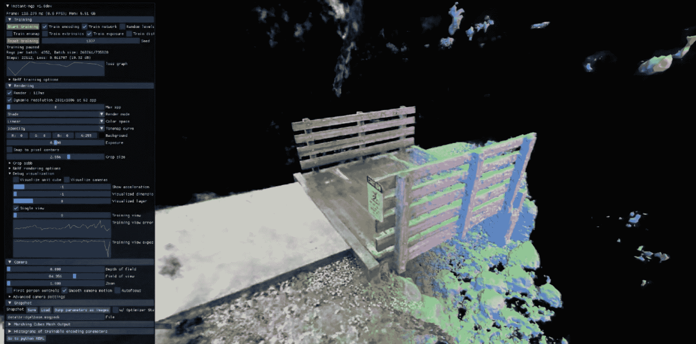

# 内尔夫:拍摄照片，而不是泡沫飞镖，看看周围的角落

> 原文：<https://hackaday.com/2022/06/22/nerf-shoot-photos-not-foam-darts-to-see-around-corners/>

读者可能熟悉摄影测量学，这是一种从物体或场景的一系列 2D 照片中创建 3D 几何图形的方法。要完成它，你需要大量的照片，数百甚至数千张，都是从稍微不同的角度拍摄的。不幸的是，该技术在重叠元素导致明显遮挡的情况下会受到影响，并且在每张照片中看起来颜色不同的闪亮或反射表面也会导致问题。

但是 NVIDIA [的新研究将摄影测量与人工智能](https://blogs.nvidia.com/blog/2022/03/25/instant-nerf-research-3d-ai/)结合在一起，创造了开发者所说的即时神经辐射场(NeRF)。根据英伟达的说法，他们的方法不仅需要更少的图像，只有几十张，而且人工智能能够更好地应对传统摄影测量的痛点；填充被遮挡区域的间隙，并利用反射来创建更真实的 3D 场景，以重建闪亮材料在其原始环境中的外观。

如果你的机器上有兼容 CUDA 的 NVIDIA 显卡，你现在就可以尝试一下这项技术。[休息之后的教程视频](https://www.youtube.com/watch?v=z3-fjYzd0BA)将带您了解设置和一些基础知识，展示 3D 重建如何在几分钟内逐步完善，然后可以像游戏引擎中的场景一样进行探索。Instant-NeRF 工具包括相机路径关键帧，用于导出比实时预览质量更高的动画。这项技术似乎比 3D 打印模型更适合输出视图和动画，尽管两者都是可能的。

没有最新最棒的 NVIDIA 芯片？不要担心，你仍然可以使用“老派”摄影测量来创建一些令人印象深刻的 3D 扫描——你真正需要的只是一台相机和一个电动转盘。

 [https://www.youtube.com/embed/z3-fjYzd0BA?version=3&rel=1&showsearch=0&showinfo=1&iv_load_policy=1&fs=1&hl=en-US&autohide=2&wmode=transparent](https://www.youtube.com/embed/z3-fjYzd0BA?version=3&rel=1&showsearch=0&showinfo=1&iv_load_policy=1&fs=1&hl=en-US&autohide=2&wmode=transparent)

