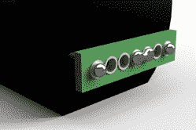

# 电磁脉冲盒 V2 使加扰袖珍计算器变得容易

> 原文：<https://hackaday.com/2022/06/20/scrambling-pocket-calculators-made-easy-with-emp-box-v2/>

一段时间以来，罗斯季斯拉夫·珀森一直对制造能够干扰附近电子设备的小型便携式电磁脉冲装置感兴趣。在这些电磁脉冲装置中，高电压被用来产生一个便携式[火花隙](https://en.wikipedia.org/wiki/Spark_gap)发生器，它的运行反过来产生电磁脉冲，能够重置或扰乱附近的电子设备，如袖珍计算器。

Bridging adjacent holes narrows the spark gap, resulting in more frequent pulses.

他最初的 EMP 盒设计依赖于火花隙，火花隙由拧入透明塑料绝缘体的金属螺钉构成，但这一最新设计摒弃了繁琐的螺钉调整，而是依赖于 perfboard。通过切出一排电镀穿孔板孔并将高压端子焊接到两端，中间的空孔形成火花隙的主要部分。

它甚至是可调的:人们只需用焊料桥接相邻的孔，就能有效地减小间隙。至于产生高电压本身，亚马逊的 DC 电压倍增器会处理。观看设备重置下面短视频中的一些计算器。

寻找不那么粗略的高压实验？给自己弄一个范德格拉夫发电机，一些金属球，一点点油，做一些艺术品。

 <https://hackaday.com/wp-content/uploads/2022/06/NEW_EMP_001.mp4?_=1>

[https://hackaday.com/wp-content/uploads/2022/06/NEW_EMP_001.mp4](https://hackaday.com/wp-content/uploads/2022/06/NEW_EMP_001.mp4)