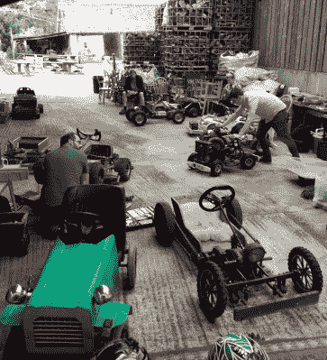
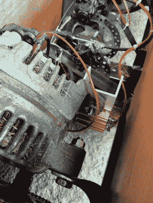

# 一辆 500 的小型电动车，你能推多远；四年的赛车生涯

> 原文：<https://hackaday.com/2022/06/22/how-far-can-you-push-a-500-small-electric-car-four-years-of-the-hacky-racer/>

四年前，当疫情的想法仅仅让一些流行病学家担忧时，一群英国硬件黑客和机器人战斗爱好者提出了一个想法。他们将从美国[动力赛车系列](http://powerracingseries.org/)中获得灵感，创造自己的小型电动赛车方程式。 [Hacky Racers](http://hackyracers.co.uk/) 成为其跨大西洋表亲在混合路面而不是柏油路面上比赛的粗糙版本，作为第一批参赛者在萨默塞特郡的苹果酒农场召开的首次会议，尝试一下。上周末，在 Hacky Racer 开发了四年之后，他们回到了同一个农场，比赛被疫情打断，Hackaday 再次来到这里，看看赛车是如何演变的。

## 这可能是你用 500 英镑能得到的最大乐趣了

A busy Hacky Racer pit scene

我们已经提到了足够多的 Hacky Racers 和 Power Racing，许多读者可能对它们很熟悉，但回顾一下，管理该系列的规则规定了 1500 毫米和 900 毫米的最大长度和宽度，2 马力的功率限制，由适用于所用电压的适当保险丝强制执行，以及 500 英镑(约 600 美元)的预算限制。为了与动力赛车的灵感保持一致，许多车辆都采用了创造性的车身设计，结果是一个最高时速在 15 英里/小时至 20 英里/小时(约 30 公里/小时)之间的汽车领域。

在 2018 年的第一次 Hacky Racer 会议上，有各种发电厂。有一些 24 V DC 从移动踏板车传动轴，一些 DC 从高尔夫球车发电厂，以及更快的车辆具有 2 马力无刷自动人力车电机。大多数底盘设计都是由捐赠机器改造而来，电机控制器是商品化的中国模块。因此，看看几年的发展如何演变成这个公式是很有趣的。四年后，较新的机器都有定制的底盘设计，没有任何基于移动或高尔夫的 DC 汽车展出，人力车电机已加入了转换汽车交流发电机。很明显，正是在这些最后的发电厂中，大部分的开发工作正在进行，所以值得仔细看看。

## 用最便宜的无刷电机推动极限

早在 2020 年初，我们就讨论过[交流发电机到电动机的转换](https://hackaday.com/2020/01/16/car-alternators-make-great-electric-motors-heres-how/)，从中我们知道，它们需要磁场绕组的 DC 偏置以及来自电动机控制器的三相交流电。实验表明，根据交流发电机的不同，这种绕组需要约 2 A 至 5 A 的电流，但最有趣的技术发展在于管理这一数字。

Dropper resistors for the field widing can be seen behind this converted alternator. There seems to have been a bit of grass picked up during the previous race.

在无刷电机中，定子是一块磁铁，它在一组围绕它的线圈产生的磁场中旋转。像大多数较小的无刷电机一样，人力车电机有一个永磁体作为转子，工作良好，但容易过热。交流发电机有一个带一组电刷的电磁体作为定子，这个电磁体形成励磁线圈。线圈中的电流越大，磁场就越强，因此电机产生的扭矩就越大。更多的磁场也意味着更多的反电动势，因为电机控制器必须抵消这种反电动势，有一个权衡，即最高速度较低时，电流较高，扭矩较大。因此，这些电机的有趣发展是采用可变励磁电流来选择所需的扭矩和最高速度组合。

提供励磁电流的最简单方法是将一个合适的电阻与励磁线圈串联，并将其直接连接到电池上。这似乎是目前的首选路线，一台机器使用一对继电器选择的电阻器，通过方向盘上的按钮来控制不同的电机扭矩。这种第一代磁场控制正在被有源电子设备取代，一名赛车手使用小型 DC 电机控制器为线圈供电，另一名赛车手则在试验一种降压转换器，最终将磁场电流映射为特定速度下的最佳扭矩。

很明显，Hacky Racers 正在推动他们的公式的发展，他们这样做的同时保留了这项活动的 have-a-go 特性，这是他们的功劳。赛车运动被所谓的支票簿赛车手搞得一团糟，在这方面，脾气暴躁的赛车手加入了剪草车比赛，以此来消除那些太把自己当回事的方程式赛车。与此同时，汽车交流发电机作为无刷电机的发展对任何尝试小规模电力牵引的人都有巨大的价值，因此我们期待这些技术的进一步完善。

当我们结束这篇文章时，值得一提的是举办 Hacky Racers 的场地，因为他们放下了他们的头发。North Down Orchard 是一个萨默塞特苹果酒农场，有露营设施和一个极好的苹果酒仓库。我们在 Hackaday [的一些人是高质量真正苹果酒的鉴赏家](https://www.youtube.com/watch?v=1SKcqXtGsBw)，我们全心全意地享受 North Down 的苹果酒，这是一种特别精心制作的艺术范例。我们希望 Hacky Racers 再次聚集在那里，我们期待为您带来他们在此期间取得的任何新的技术进步。