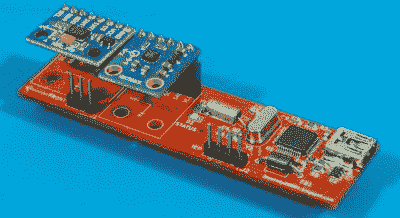

# 星标用星状体保持瞄准目标

> 原文：<https://hackaday.com/2022/06/23/starpointer-keeps-scope-on-target-with-stellarium/>

在中等功率的天文望远镜上，一个小的“寻象镜”通常被安装在与主镜平行的位置，以帮助较大的仪器对准目标。finderscope 的低放大率提供了比主望远镜更宽的视野，这使得它更容易发现天空中的小物体。即使你的目标太小或太暗而无法在取景器中看到，只要能够让你的主望远镜指向正确的天体邻域，就是一个巨大的帮助。

但是(迪尔山·贾亚科迪)仍然认为他还可以做一些改进。他的星标不是一个小的光学望远镜，而是一个电子设备，可以确定它所安装的望远镜的方向。当 STM32F103C8 供电的小工具中的 ADXL345 加速度计和 HMC5883L 磁力计检测到运动时，角度数据被发送到*Stellarium*——一个开源的天象仪程序。结合已知的纬度和经度，这允许软件显示望远镜当前在夜空中的指向。

 正如休息后的视频所示，这提供了实时反馈，即使对于绝对的初学者也很容易理解:你所需要做的就是旋转瞄准镜，直到你想看的物体在十字准线下。虽然我们不建议在试图从你的望远镜目镜中挑出暗淡的物体之前看着明亮的电脑屏幕，但我们肯定可以看到这种“虚拟”取景器的吸引力。

话说回来……谁说这项技术必须局限于光学观测？由于 StarPointer 是一个开放的硬件项目，你可以将这项技术集成到你一直梦想在后院建造的 DIY 射电望远镜中。

 [https://www.youtube.com/embed/OOE7l4sul2Y?version=3&rel=1&showsearch=0&showinfo=1&iv_load_policy=1&fs=1&hl=en-US&autohide=2&wmode=transparent](https://www.youtube.com/embed/OOE7l4sul2Y?version=3&rel=1&showsearch=0&showinfo=1&iv_load_policy=1&fs=1&hl=en-US&autohide=2&wmode=transparent)

