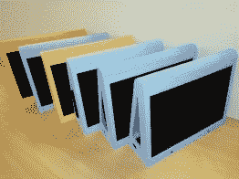
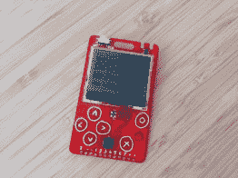
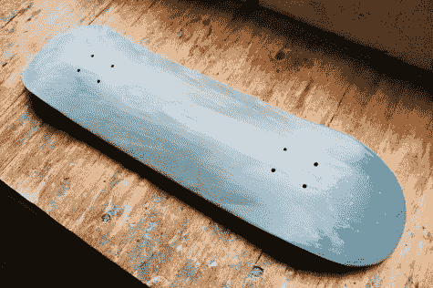
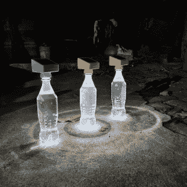
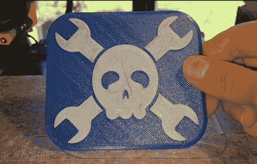
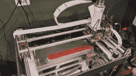
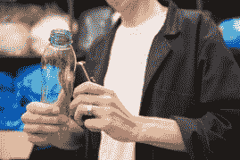

# 2022 年黑客日奖:再利用、回收、改造决赛选手

> 原文：<https://hackaday.com/2022/06/28/2022-hackaday-prize-reuse-recycle-revamp-finalists/>

2022 年 Hackaday 奖的主题是保护地球。我们第二轮挑战的主题“减少、回收、改造”是关于定制您的项目，以利用现有资源，并使材料远离垃圾填埋场，而不是增加垃圾。我们的评委仔细检查了参赛作品，然后把密封的信封递给了我。所有这十个项目将立即获得 500 美元，并有资格获得 50，000 美元的大奖，将于 11 月公布。

在这一轮中，我们寻找两大类回收项目，要么是在其建造中包含重要回收成分的项目，要么是促进回收本身的项目，坦率地说，我们得到了两者的良好组合！

在第一条战线上，我们看到了回收[塑料瓶](https://hackaday.io/project/185217)、[液晶显示屏](https://hackaday.io/project/185291)和[激光切割时不可避免的丙烯酸下脚料](https://hackaday.io/project/185491)的项目。X-PC 甚至通过创建一个框架来将笔记本电脑作为独立的台式机安装，从而回收了笔记本电脑的大部分部件，而 [ABN6502](https://hackaday.io/project/184725-abn6502-sbc-r1) 使用收集来的集成电路来制作微型计算机。[由再生塑料制成的滑板甲板](https://hackaday.io/project/185588)？我们必须对它们进行测试，但这是一个很酷的想法，也是一个很棒的项目。

          

在用于回收的机器类别中，我们看到了一个整洁项目的新进展，即[塑料扫描仪](https://hackaday.io/project/185532)，其目的是建立一种可以区分可回收塑料类型的设备。显然，我们的 3D 打印机使用的塑料正在研磨许多人的环保齿轮，因为我们有[细丝再挤出机](https://hackaday.io/project/185196)、[细丝回收机](https://hackaday.io/project/185304)，甚至还有一台[垃圾打印机](https://hackaday.io/project/185691)，它接收废塑料并直接将其挤出成型。

      

你可以查看所有入围名单，排名不分先后。如果你有一个项目旨在通过修理而不是回收设备来防止设备被填埋，请确保参加正在进行的 [Hack It Back challenge](https://hackaday.io/contest/184555-supplyframe-designlab-2022-hackaday-prize) 。

我们祝贺所有的决赛选手！

## 来自再利用、回收、改造的十位入围者

The [HackadayPrize2022](https://prize.supplyframe.com) is Sponsored by: