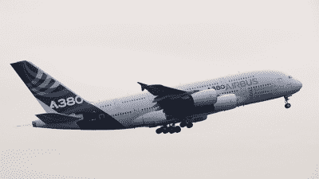
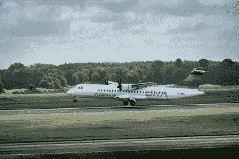

# 空客 A380 完成食用油驱动的飞行

> 原文：<https://hackaday.com/2022/07/12/airbus-a380-completes-flight-powered-by-cooking-oil/>

最近，化石燃料因为各种错误的原因而成为新闻。无论是它们对全球气候变化的贡献，还是价格和供应取决于暴力地缘政治的事实，现在比以往任何时候都有更多的理由转向更清洁的能源。

在航空领域，这意味着找到更清洁的燃料来源。今年早些时候的一次测试就是为了追求这个目标，一架空客 A380 客机完全依靠从食用油中提取的燃料飞行。

## 可持续燃料是关键

An Airbus A380 served as the testbed for 100% SAF fuel, running one engine solely on the cooking oil-derived product. The world’s largest airliner is seeing declining use as smaller, more fuel-efficient planes are taking over. Credit: Airbus

在全球范围内，航空活动产生的二氧化碳排放量中约有 2.1%可归因于人类活动。总的来说，它占整个交通运输排放的 12%。虽然由于[新冠肺炎疫情的影响，](https://hackaday.com/2020/04/10/covid-19-and-the-state-of-the-climate/)总体而言，排放量有所下降，但随着该行业恢复正常运营，这些排放量有回升的趋势。

减少这一数字的一个方法是转向可持续的燃料来源。当化石燃料被挖掘和燃烧时，它们将储存的碳释放到大气中，造成气候变暖。然而，所谓的可持续航空燃料(SAF)通过依赖有机成分来解决这个问题。这个想法是，燃烧释放的二氧化碳被作物吸收的二氧化碳和生产中使用的有机物抵消。它并不完美，当然也不是真正的零排放解决方案；除了损失和低效率之外，所有类型的内燃机都会产生其他有害气体，如氮氧化物。然而，这仍然是对传统化石燃料的重大改进；空客声称，使用 SAF 的飞机可以减少 53%到 71%的碳排放。

为了展示这一概念，一架空客 A380 于 3 月 25 日从法国图卢兹的布拉尼亚克机场起飞，该机场是空客的总部所在地。这架飞机完成了三个小时的飞行，一台劳斯莱斯遄达 900 喷气发动机使用 100%的可持续航空燃料。3 月 29 日进行了进一步的测试，在要求苛刻的起飞和着陆阶段使用了这种燃料。

Neste, ATR, and Swedish airline Braathens Regional Airlines teamed up to run a plane on 100% SAF in both engines. The companies hope to get certification to run 100% sustainable fuel by 2025\. Photo credit: ATR

测试所用的燃料来自法国 TotalEnergies 公司。使用的特殊类型的 SAF 燃料被称为 HEFA-SPK，或加氢处理酯和脂肪酸-合成石蜡煤油。它是通过对废弃食用油和脂肪进行化学处理而制成的，化学处理将它加工成煤油型喷气燃料的可用替代品。

HEFA-SPK 燃料在很多方面都是一项成熟的技术，并且已经在今天的航空业中使用。空中客车公司的飞机已经被批准使用 50%的 HEFA-SPK 混合燃料，占全球喷气燃料使用量的 1%。然而，就目前而言，它仍然比普通的喷气燃料更贵，而且产量有限，减缓了它的吸收。

空中客车公司的测试是成功的，并建立在早期测试的基础上，获得了 50%的混合物被批准使用。该公司希望到 2020 年，飞机能够获得 100%安全飞行的认证。

他们也不是唯一在这个领域工作的公司。空客选择在 SAF 上只运行一个引擎，其他公司走得更远。瑞典 SAF 供应商 Neste 最近与 ATR 和 Braathens 区域航空公司合作完成了一项测试。成功的测试在 SAF 上运行了 ATR 72-600 小型支线客机的两个发动机。它建立在之前对单引擎的几次测试基础上，公司希望到 2025 年获得 100%安全使用的认证。

总的来说，在航空公司完全使用可持续燃料之前，还有很多工作要做。航空规章的安全意识和保守性意味着这种燃料在所有条件下被批准使用还需要一段时间。生产能力也必须提高，同时为向机场分配燃料做好准备。在缺乏促进其使用的法规的情况下，SAFs 还必须找到一种方法在价格上与化石燃料竞争，否则人们将不得不表明他们愿意支付绿色溢价。

然而，这些障碍都不是不可克服的。预计短期内会有更多的飞行使用 SAF 混合物，并在未来的一些应用中完全取代这种燃料。

[横幅图片:奥利弗·霍尔茨鲍尔的《弗·WWOW》。空中客车 A380-800 由史蒂夫艾略特。]