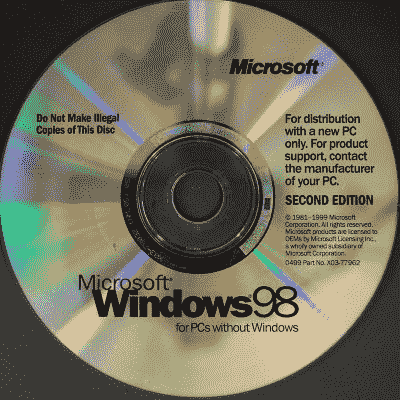
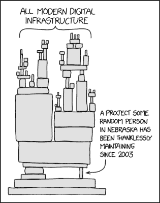

# 飞船用的 Windows 98？不完全是！

> 原文：<https://hackaday.com/2022/07/06/windows-98-for-spaceships-not-quite/>

本周在黑客编辑中引起最多议论的新闻之一是 [ESA 的火星快车任务正在接受软件更新](https://www.esa.int/Enabling_Support/Operations/Software_upgrade_for_19-year-old_martian_water-spotter)。他们正在将操作系统升级到…Windows 98。

微软 90 年代末的消费者桌面操作系统不会是第一个想到适合航天器的，但欧空局很快提醒我们，依赖它的是开发工具链，而不是飞行器本身。发现 Windows 98 被用于这样一个意想不到的目的仍然是相当令人惊讶的，这使我们再次考虑那些现在几乎被遗忘的操作系统，并质疑它还能在哪里找到。

## 赢，还是输？

This CD stood on the shoulders of 16-bit giants. Mark Morgan, [CC BY 2.0](https://commons.wikimedia.org/wiki/File:CD_Room_de_instalaci%C3%B3n_de_Windows_98.jpg).

对于那些从未使用过早期 Windows 版本的人来说，也许是时候上一堂简短的历史课了。最初的 IBM 个人电脑和克隆产品配有 DOS、PC-DOS 或 MS-DOS，这是微软的 16 位单任务操作系统，带有命令行界面。

到 20 世纪 80 年代末，他们已经开发出了最初的几个版本的 Windows，一个 16 位的图形用户界面，并通过一组额外的 API 进一步扩展了 DOS。要运行这些早期的 Windows 版本，你必须首先启动 DOS，然后在命令行输入 **win** 来启动 Windows。

与此同时，在 20 世纪 90 年代初，他们生产了第一个独立的操作系统系列，被称为 Windows 新技术，简称 NT。这些是本机 32 位操作系统，包含全套 Windows APIs，包括本机 32 位支持，旨在与企业级的低端 UNIX 机器竞争。与此同时，基于 DOS 的 Windows 版本获得了一组 32 位 API 扩展，并最终演变成更现代的 Windows 95、98 和 ME 的 GUI。仍然可以将 Windows 98 引导到 DOS 提示符下，键入 **win** 来启动桌面，但此时底层技术已经达到极限，结果往往是错误百出，不可靠。在 2000 年早期，它们已经停产，下一个被称为 Windows XP 的 Windows NT 版本也瞄准了消费者市场。

## 窥视一位 90 年代科学家的思想

Is that single project in fact a crusty old beige-box Pentium running some ASP? XKCD 2347([CC BY-NC 2.5](https://xkcd.com/2347/)).

所以我们回到火星快车。在设计这种工艺的时候，可以说 Windows NT 及其后继者是一种稳定的产品，比消费者操作系统稳定得多。桌面操作系统的成果最终进入太空，是因为控制研究人员 it 预算的人在软件和 PC 采购上稍微节省了一点吗？我们可能永远不会知道，但鉴于它似乎已经交付了货物，也许这毕竟不是一个坏的选择。

所有这些都让我们想到了一个问题:哪里还有 WIndows 98 的副本？当然，你们中的一些人会有复古的游戏电脑，毫无疑问，会有上了年纪的亲戚仍在使用它的故事，更不用说一些 20 世纪 90 年代的测试设备运行它。即使是著名的迈凯轮 F1 超级跑车[也只能用 20 世纪 90 年代康柏笔记本电脑](https://jalopnik.com/this-ancient-laptop-is-the-only-key-to-the-most-valuabl-1773662267)的特定型号进行维修。但这些都不是关键任务。相反，我们希望你能告诉我们，Windows 98 在野外有什么令人惊奇的地方，甚至有什么不应该有的地方。自 2006 年以来就不再受支持的近四分之一世纪的旧操作系统是否支撑着某处庞大的服务塔？我们真的不确定我们是否想知道。

表头:贾维 1977， [CC0](https://commons.wikimedia.org/wiki/File:Windows_9x_Blue_Screen_of_Death_recreated_in_Fixedsys.svg) ，费德里科·贝卡里， [CC0](https://commons.wikimedia.org/wiki/File:Night_sky_unsplash.jpg) 。