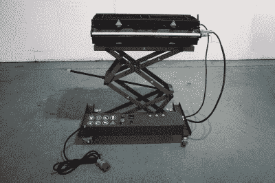

# Hackaday 播客 175:月光石和蟑螂食糜，树莓派 IPad，和复古的磁带卡座

> 原文：<https://hackaday.com/2022/07/01/hackaday-podcast-175-moonrocks-and-cockroach-chyme-a-raspberry-pi-ipad-and-a-retro-respectful-tape-deck/>

加入主编埃利奥特·威廉姆斯和作业编辑克里斯蒂娜·帕诺斯的行列，我们一起咒骂和讨论过去一周所有最糟糕的黑客行为。我们以一个温和的提醒开始这一集，即[奇怪的输入和特殊的外设竞赛](https://hackaday.io/contest/185414-odd-inputs-and-peculiar-peripherals)将在 7 月 4 日星期一，太平洋标准时间上午 8:30 结束[。到目前为止，我们已经看到了大量很酷的条目，包括我们渴望为博客撰写的新版本的【彼得·莱昂斯】](https://www.timeanddate.com/countdown/wfh?iso=20220704T0830&p0=871&msg=Odd+Inputs+and+Peculiar+Peripherals+Contest+ends%21&font=slab) [Squeezebox 键盘](https://hackaday.com/2021/04/26/where-were-going-we-dont-need-keycaps/)。

 其他大赛消息，2022 年黑客日奖的[再利用、回收、改造挑战赛](https://hackaday.com/2022/06/28/2022-hackaday-prize-reuse-recycle-revamp-finalists/)第二轮获胜者已经揭晓。埃利奥特对[杰森·奈特]的[开源回收滑板甲板制作设备](https://hackaday.io/project/185588-rpsd-recycled-plastic-skateboard-deck)非常感兴趣，克里斯蒂娜希望她有时间和金钱来制造一些基本的[珍贵的塑料机器](https://preciousplastic.com/solutions/machines/overview.html)。

埃利奥特设法用本周的*那是什么声音*难倒了克里斯蒂娜，尽管她可能应该做出一个半教育的猜测。从那以后，在我们进入几个竞赛项目之前，它就在失踪的月球岩石和每日一词上，包括结束所有机械键盘的机械键盘。

这真的只是触及了本周展览的表面，其中包括一些新的硬件塞进旧的，以及旧技术的现代实现。如果你还没看够克里斯蒂娜的童年回忆录，她会深入到她记忆宫殿里的泰迪熊和电话间。

[//html5-player.libsyn.com/embed/episode/id/23602142/height/90/theme/custom/thumbnail/yes/direction/backward/render-playlist/no/custom-color/000000/](//html5-player.libsyn.com/embed/episode/id/23602142/height/90/theme/custom/thumbnail/yes/direction/backward/render-playlist/no/custom-color/000000/)

[直接下载](https://traffic.libsyn.com/secure/hackaday/Hackaday_Podcast-Ep175.mp3)，录到磁带上，在你的音箱上播放。

如果你想继续关注，请点击下面的链接，并一如既往地在评论中告诉我们你对这一集的看法！

Where to Follow Hackaday Podcast

### 关注 Hackaday 播客的地方:

*   [谷歌播客](https://podcasts.google.com/feed/aHR0cDovL2ZlZWRzLnNvdW5kY2xvdWQuY29tL3VzZXJzL3NvdW5kY2xvdWQ6dXNlcnM6OTM5MTM0NzIvc291bmRzLnJzcw)
*   [iTunes](https://itunes.apple.com/us/podcast/hackaday-podcast/id1447409683)
*   [Spotify](https://open.spotify.com/show/3NRV0mhZa8xeRT0EyLPaIp)
*   [装订机](https://www.stitcher.com/podcast/hackaday-podcast)
*   [RSS](http://hackaday.libsyn.com/rss)

## 第 175 集节目说明:

#### 那是什么声音？

*   你知道本周的声音吗？[参加比赛有机会赢得](https://docs.google.com/forms/d/e/1FAIpQLSc5GBOGDVW2coclFxnCoUmBjObnUmXIdAGz7mychG5bSYpwgA/viewform?usp=sf_link)一件梦寐以求的 Hackaday 播客 t 恤！

#### 本周有趣的黑客:

*   美国宇航局来电，他们想要回他们的蟑螂
    *   [NASA 新闻|萨德·罗伯茨——偷月球岩石“在月球上做爱”的 NASA 实习生](https://www.timesnownews.com/the-buzz/article/thad-roberts-the-nasa-intern-who-stole-lunar-rocks-to-have-sex-on-the-moon/748813)
    *   [被盗和失踪的月球岩石——维基百科](https://en.wikipedia.org/wiki/Stolen_and_missing_Moon_rocks)
*   [仿复古“磁带”播放器运行在 ESP32 和 80s Vibes 上](https://hackaday.com/2022/06/23/faux-retro-tape-player-runs-on-esp32-and-80s-vibes/)
*   [挤压树脂 FDM 印刷(用激光！)](https://hackaday.com/2022/06/22/extruded-resin-fdm-printing-with-lasers/)
*   [机械键盘结束了，这个设备赢了](https://hackaday.com/2022/06/24/mechanical-keyboards-are-over-this-device-has-won/)
*   【2022 年黑客日大奖:为你的旧 IPad 升级一个 CM4 版本
*   口袋电脑让我们想起 PDA

#### 快速破解:

*   埃利奥特的选择:
    *   [3D 扫描麻烦？本指南涵盖了](https://hackaday.com/2022/06/26/3d-scanning-trouble-this-guide-has-you-covered/)
    *   [对被遗忘的 Konami 街机硬件进行逆向工程](https://hackaday.com/2022/06/28/reverse-engineering-forgotten-konami-arcade-hardware/)
    *   [屏蔽廉价 RTL-SDR 棒](https://hackaday.com/2022/06/29/shielding-a-cheap-rtl-sdr-stick/)
*   克里斯蒂娜的选择:
    *   【2022 年 Hackaday 奖:多光谱智能手机摄像头揭示画作的内在秘密
    *   [神经网络识别鸟叫，甚至在你的 Pi 上](https://hackaday.com/2022/06/25/neural-network-identifies-bird-calls-even-on-your-pi/)
    *   [深入了解触觉智能旋钮](https://hackaday.com/2022/06/24/an-in-depth-look-at-the-haptic-smart-knob/)

#### 不能错过的文章: