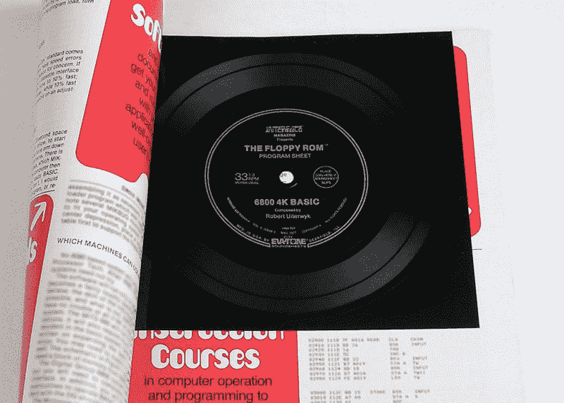
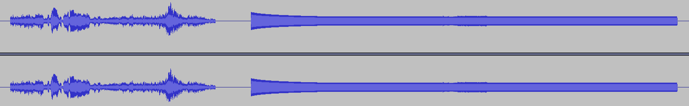
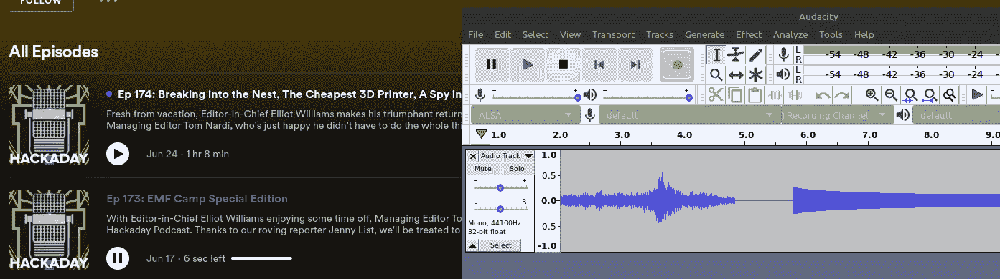

# 解开黑客日播客隐藏的信息

> 原文：<https://hackaday.com/2022/07/01/unraveling-the-hackaday-podcast-hidden-message/>

当埃利奥特和我为每周播客录制原始音频时，我们花两个小时的大部分时间从一个主题漫游到另一个主题并不罕见。在这些扩展的 gab 会话中，我们想知道是否有可能将数字信号嵌入到播客中，使其能够被听众解码。当然，通过声音存储和传输数据并不是什么新鲜事——但是播客格式本身引入了一定程度的不确定性。

编码后的声音能在压缩成 MP3 后保存下来吗？分发文件的联合服务，或者听众用来回放文件的各种客户机，会不会把水搅浑？有没有可能整个事件会被标记为恶意的？在一点疯狂的猜测之后，谈话转移到了另一个话题上，这个想法被留在我们无数的闲人中的一个上。

 也就是说，直到埃利奥特去度假了几个星期才回来。为了取代常规剧集，我们同意[我将尝试制作一个特别版](https://hackaday.com/2022/06/17/hackaday-podcast-173-emf-camp-special-edition/)，由几个 Hackaday 贡献者预先录制的片段组成。我们认为这种简化的方法会让我更容易编辑，或者从另一个角度来看，我更难搞砸。这是我第一次有机会亲自监督一集的录制、制作和发行。这一点，以及我的老板不在镇上的事实，使它成为一个完美的机会来尝试和精心制作一个隐藏的消息，供黑客社区发现。

我现在很高兴地宣布，在 *EMF Camp 特别版*剧集发布 11 天后，[摆渡人](https://hackaday.io/ferryman)成为第一个想出所有步骤并得到最终消息的人。当你读到这里的时候，一件令人垂涎的 Hackaday 播客 t 恤已经被送到了他们的所在地。

由于不再有任何竞争来看谁先到达那里，我认为这将是一个很好的时间来检查消息是如何准备的，并记录我在实验中所做的一些有趣的观察。

## 沿着黄砖路走

如前所述，将数字数据编码成可听见的声音绝不是一项新技术。甚至有一段时间，普通标准的录音带被用来分发商业软件。因此，我没有重新发明轮子，想出一些新的方法将信息的第一部分转换成音频，而是选择了一个真正经典的方法:[堪萨斯城标准报(KCS)](https://en.wikipedia.org/wiki/Kansas_City_standard) 。

In the late 1970s, KCS audio was even pressed onto vinyl records.

《KCS》是 1975 年由《字节》杂志主办的一次会议的产物，旨在成为在盒式磁带上存储数字数据的通用标准。最初的设计是为了提供高达每秒 300 位的速度，后来的版本以牺牲互操作性为代价勉强提高了数据速率。

最后，KCS 并不太成功，因为个别公司似乎执意要用自己专有的方式做同样的事情(听起来很熟悉吧？)，但它确实奠定了重要的基础，并且一些编码器/解码器包今天仍然可用。

最初的 20 个字符的信息由 David Beazley 使用 py-kcs 编码成 WAV 文件[。作为抽查，我还通过马丁·沃德](http://www.dabeaz.com/py-kcs/)编写的 KCS 的 [Perl 实现运行了相同的消息。我非常担心没有多少听众会熟悉这种有着近 50 年历史的盒式磁带音频格式，所以在最后一刻，我添加了一点线索，那就是多尔西著名的《绿野仙踪》中*的台词“托托，我感觉我们已经不在堪萨斯州了”。最后，因为秘密信息总是要倒着播放，所以我把整个东西倒过来，在埃利奥特的最终母带剧本之前，把它钉在编辑过的那集的结尾。*](http://www.gkc.org.uk/martin/software/index.html#CUTS)

<https://hackaday.com/wp-content/uploads/2022/06/podcode_original.wav?_=1>

[https://hackaday.com/wp-content/uploads/2022/06/podcode_original.wav](https://hackaday.com/wp-content/uploads/2022/06/podcode_original.wav)

请注意，与多尔西讲话的波形相比，KCS 数据具有非常清晰的数字特性。我敢肯定，任何在音频编辑器中打开它的人都会立即意识到这里不仅仅是噪音。但是在 Elliot 精心制作的 Podcast Perfection Bash 脚本完成之后，它会是什么样子呢？

嗯，那不一样。转换成立体声应该不成问题，但显然脚本在 MP3 编码过程中完成了清理工作。多尔西的声音现在更加突出，如果你仔细想想，这是有道理的，因为文件只是通过一个旨在使播客听起来更好的脚本运行。但是数据现在不再是一系列完美的方波，因为它在开始时有一个奇怪的衰减。更重要的是，我们现在可以清楚地看到信号中间的编码数据。

[Elliot:缓慢启动的压缩器/限制器使我们不断变化的音量保持相对恒定。而且那个数字音频部分本来就是 *waaay* 太吵了。如果它以平均音量开始，它根本就不会被闪避。]

尽管我最初有些担心，但是 MP3 版本的声音仍然可以被前面提到的工具正确解码，只要它首先被转换成他们期望的 WAV 文件。确信消息是完整的，这一集被发送到联合服务，以便在第二天早上推出。

## 你现在能听到我吗？

一旦播客在周五早上推出，真正的乐趣就开始了。Spotify 或谷歌播客会把它踢回去吗？它们末端的一些自动微调会不会因为前面有太多死气而切断信号？简短的回答似乎是……没人在乎。我觉得这有点像 Kindle 商店里的恐龙情色读物；一旦你完全承诺让人们上传他们想要的任何东西，你就必须接受偶尔会有古怪的人。

据我所知，这一集在所有不同的服务上如期播放。我们有几个人给我们发电子邮件，问我们是否知道这一集结尾的“奇怪噪音”，而在 [Hackaday Discord](https://discord.com/invite/NkbHrAW7NG) 中的一些人明智地建议戴耳机的人避开最后几秒钟，但仅此而已。

但是信息保存下来了吗，用户如何提取它呢？为了便于讨论，让我们忘记我们为每个播客提供了 MP3 的直接下载，因为显然这是最直接的途径。我想看看是否有可能从各种播客服务中提取信息。所以我设置 Audacity 从系统音频的监视器中录音，在 Spotify、Google 和 TuneIn 的网络播放器中打开播客，然后直接跳到音轨的末尾。

果不其然，直接从网上获取的音频使用 KCS 工具正确解码。接下来，我想知道我是否可以将不同的播客播放工具，如我的 Pixel 4 或 Echo Show 插入计算机，并直接记录它们的音频。

有趣的是，这实际上引起了一些问题。虽然 Audacity 中的波形看起来是一样的，`py-kcs`通常会在预期的字符串前面添加垃圾字符。Martin Ward 的 Perl 工具表现稍好，但也会偶尔出错。从我的 Thinkpad T400 和联想 Chromebook 上录音时，结果是一样的。我不确定这是为什么，我很想听听任何有想法的人的意见。

Recording from AntennaPod on an Android device introduced unexpected errors.

也就是说，如果您忽略了损坏的数据，适当的消息仍然可以通过。所以我称之为部分胜利，因为如果你眯着眼看结果，你仍然可以进入下一步。

## 真相就在那里

所以现在我们有了答案。不仅完全可以使用像堪萨斯城标准这样的编码方案将数字数据放入播客中，而且即使听众无法访问原始 MP3 文件，也可以在接收端轻松地将数据提取出来。

但是解码信号的内容是什么，一旦有了，你用它做什么？我从没答应过告诉你一切。不过不要担心，这篇文章会让你成功一半。毕竟，我们的意图从来不是让这个*变得太*困难，这只是一个实验。

当然，现在我们知道这个概念是声音，下次我们在播客的一集里隐藏一个信息的时候……希望你的工作已经为你完成了。