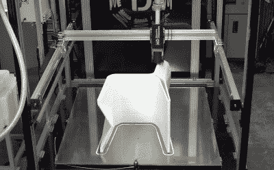

# 大幅面 3D 打印机是一项严峻的工程挑战

> 原文：<https://hackaday.com/2022/07/27/large-format-3d-printer-is-a-serious-engineering-challenge/>

当你想建造一台大幅面 3D 打印机时，你不能只是扩大台式机的设计。在一个出色的四部分构建系列(休息后的视频)中，[D-flo 博士]带我们经历了他在构建一台打印量为 4x4x4 英尺(1.2 米立方体)的 3D 打印机时必须应对的所有工程挑战。

对于如此大的打印量，您不会使用 0.4 毫米的喷嘴进行打印。打印机的核心是一台商用大尺寸 MDPH2 颗粒挤出机，每小时能够通过 1.5 毫米至 5 毫米的喷嘴挤出约 1 千克塑料。为了给挤出机供料，[flo 博士]使用文丘里真空系统定期从大料斗中吸取颗粒。该系统由压缩空气驱动，压缩空气可以将水分引入仔细干燥的颗粒中。为了降低湿度水平，压缩空气通过一系列垂直铝管，让水分凝结并从底部排出。

 重达 8.4 公斤，它需要一个强大的运动平台来移动它。[flo 博士]采用固定床设计，挤出机由七个高扭矩 NEMA23 电机推动，电机安装在由 C 型梁铝型材制成的大型龙门架上。这种尺寸的机器需要非常坚固，部件配合良好，所以[flo 博士]大量使用数控加工的铝制部件。

为了实现动态床调平，[D-Flow 博士]采用了四机架调平(GQL)方案。这意味着四个 Z 致动器中的每一个都将基于来自调平探针的输入动态地调整其位置。为了避免给将 X-Y 门架固定到 Z 托架板上的角支架施加应力，他在安装点使用了径向球面轴承，以允许有几度的间隙。

构建板由一个铝板组成，该铝板在 25 个位置用螺栓固定在底座上，并带有可调节的弹簧。一个巨大的 6000 瓦 220 伏加热垫粘在底部，而实际的打印表面是一大片硼硅酸盐玻璃。一个主要问题是当加热到工作温度时，构建板的变形，但通过所有的调节选项[flo 博士]能够将高度变化降低到大约 0.25 毫米。当打印层高度为 1 毫米或更高时，这在可接受的范围内。

我们在过去展示过[大型 3D 打印机](https://hackaday.com/2022/07/04/a-3d-printer-big-enough-to-print-a-kayak/)，但是没有一台像缅因州[大学的建筑大小的 3D 打印机](https://hackaday.com/2019/12/17/humongous-3d-printer-produces-boat-and-challenges/)那么大，可以打印一艘汽艇。

 [https://www.youtube.com/embed/m7JpumMS0Po?version=3&rel=1&showsearch=0&showinfo=1&iv_load_policy=1&fs=1&hl=en-US&autohide=2&wmode=transparent](https://www.youtube.com/embed/m7JpumMS0Po?version=3&rel=1&showsearch=0&showinfo=1&iv_load_policy=1&fs=1&hl=en-US&autohide=2&wmode=transparent)

 [https://www.youtube.com/embed/xP074X8fUu8?version=3&rel=1&showsearch=0&showinfo=1&iv_load_policy=1&fs=1&hl=en-US&autohide=2&wmode=transparent](https://www.youtube.com/embed/xP074X8fUu8?version=3&rel=1&showsearch=0&showinfo=1&iv_load_policy=1&fs=1&hl=en-US&autohide=2&wmode=transparent)

 [https://www.youtube.com/embed/sW0k0BZvWno?version=3&rel=1&showsearch=0&showinfo=1&iv_load_policy=1&fs=1&hl=en-US&autohide=2&wmode=transparent](https://www.youtube.com/embed/sW0k0BZvWno?version=3&rel=1&showsearch=0&showinfo=1&iv_load_policy=1&fs=1&hl=en-US&autohide=2&wmode=transparent)

 [https://www.youtube.com/embed/s27CzktFDCg?version=3&rel=1&showsearch=0&showinfo=1&iv_load_policy=1&fs=1&hl=en-US&autohide=2&wmode=transparent](https://www.youtube.com/embed/s27CzktFDCg?version=3&rel=1&showsearch=0&showinfo=1&iv_load_policy=1&fs=1&hl=en-US&autohide=2&wmode=transparent)

