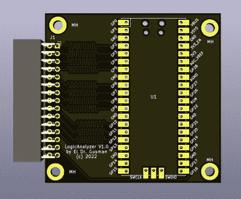

# Pico 制造功能强大的逻辑分析仪

> 原文：<https://hackaday.com/2022/07/07/pico-makes-capable-logic-analyzer/>

一个常见的微控制器项目是创建某种形式的逻辑分析仪。理论上，这应该很容易:获取一些数字输入，存储它们，并显示它们。但是，当然，细节决定成败。首先，你想快速获取数据，但你也需要实时检查触发器——这在软件中很难做到。除非您对微控制器的输入特性满意，否则您可能还需要输入调理电路。最后，您需要一种方法来转储数据以供分析。[Gusmanb]用一个围绕 Raspberry Pi Pico 构建的简单分析器[解决了所有这些问题。](https://github.com/gusmanb/logicanalyzer)

在前端和后端，有一个可选板进行快速电平转换。如果您不介意测量 3.3 V 输入，可以放弃该板。在输出端，有显示结果的定制软件。然而，真正有趣的是介于两者之间的东西。

The simple PCB is completely optional.

Pico 以 100 MHz 的速率抓取 24 位数据，并提供边沿和模式触发。这是令人印象深刻的，因为你需要在存储数据时查看数据，如果你试图在软件中这样做，会占用几个指令周期，降低最大时钟频率。那么这个项目是如何管理的呢？

它使用 Pico 的 PIO 单元，这些单元是辅助专用处理器，功能不是很强大，但它们速度非常快，具有决定性。两条 PIO 指令足以处理简单情况下的工作。然而，有两个 Pio，每个 Pio 有四个独立的状态机。这仍然需要一些工作，但这比试图以几千兆赫运行 CPU 来获得相同的效果要容易得多。特别是快速触发模式，滥用 PIO 来获得最大速度，甚至可以工作到 200 MHz，但有一些限制。

想试试的话，只要不需要电平转换，无非用一个 Pico 和一根跳线就可以了。项目页面提到定制软件避免使用 OpenBench 软件，这是我们得到的，但我们可能会使用 Sigrok 驱动程序，以避免重新发明太多轮子。作者提到开发自己的代码比遵循驱动程序协议更容易，我们也明白这一点。尽管如此，该软件看起来不错，甚至有一个 SPI 协议分析器。它都是开源的，所以如果你想在作者接触到其他协议之前得到它们，你可以自己做。

如果你真的想要一个 Pico 和 Sigrok，我们已经介绍了一个项目可以做到这一点。我们现在使用的大多数逻辑分析仪都内置在[的 FPGA 设计中](https://hackaday.com/2018/10/12/logic-analyzers-for-fpgas-a-verilog-odyssey/)。