# 拆卸:需要多少泰迪·鲁克斯平来启动一个女巫集会？

> 原文：<https://hackaday.com/2022/07/21/teardown-how-many-teddy-ruxpins-does-it-take-to-start-a-coven/>

嗯，我做到了。我克服了童年时对会说话的熊的恐惧，把一只老式泰迪熊带回家。拍卖网站上有很多他的兄弟，无论老少，可供选择。当我看到这只穿着夏威夷衬衫、没穿裤子、无忧无虑的赤脚泰迪熊时，我几乎完全失去了警惕。此外，描述承诺一个半工作单位与一个扭曲的声音，我们当中谁能抗拒在这种情况下的标本？也许走带机构的马达要坏了，或者它需要一条新皮带。可能是带子本身出错了，泰迪没事。我必须弄清楚。

但是让我倒回去一点。如果你不知道我在说什么，泰迪·鲁斯平是 1985 年推出的革命性玩具。这是一只会说话的泰迪熊，它大声朗读故事，同时随着声音移动眼睛和嘴巴。随着泰迪而来的是特殊的盒式磁带、相应的故事书和服装。我小时候想要一个，但也有点害怕它们。因为它们太贵了——约 250 美元(经通胀调整)一只熊和一盒磁带/一本书/一套装备，外加 15 美元四个 D 细胞——我年轻时从未买过。

## 阿罗哈，别西卜

泰迪从夏威夷远道而来的那天，我跑出去买了一套 C 细胞，以便检查他的状况。令我绝对高兴的是，他不仅按计划工作，而且看起来和听起来完全像恶魔！我抓起我的手机，开始记录。

[https://www.youtube.com/embed/mKyDNe0ZMf4?feature=oembed](https://www.youtube.com/embed/mKyDNe0ZMf4?feature=oembed)

> *这是一个赤脚的星期六，*
> 
> 这是一个野餐式的日子
> 
> *这是一个赤脚的星期六，*
> 
> 我们能出去玩吗？

根据这首歌的发音方式，几个角色在一起唱这首歌。当然，电话麦克风让它听起来比实际情况更糟糕，所以我把泰迪支撑在我的桌面麦克风前，做了一个更长的录音。如果你觉得你能忍受，还有一首歌两分钟后开始:

<https://hackaday.com/wp-content/uploads/2022/07/teddy-ruxpin.mp3?_=1>

[https://hackaday.com/wp-content/uploads/2022/07/teddy-ruxpin.mp3](https://hackaday.com/wp-content/uploads/2022/07/teddy-ruxpin.mp3)

此时，是进行实验的时候了。如果你还记得的话，Teddy Ruxpin 卡带很特别，因为一个轨道包含音频，另一个包含控制他的眼睛和嘴巴的伺服系统的编码。我可以通过小观察窗看到磁带上有某种特殊的声音，这可能是撒旦声音的原因。因为我周围没有其他泰迪·鲁斯平的磁带，所以我决定在普通的卡式录音机上听听这盘磁带(我在 1999 年买的 Hello Kitty 音箱，排列成 Audacity):

<https://hackaday.com/wp-content/uploads/2022/07/teddy-ruxpin-regular-tape-deck.mp3?_=2>

[https://hackaday.com/wp-content/uploads/2022/07/teddy-ruxpin-regular-tape-deck.mp3](https://hackaday.com/wp-content/uploads/2022/07/teddy-ruxpin-regular-tape-deck.mp3)

哦！所以这是另一种怪异，不是吗？那些 20 世纪 60 年代的外太空噪音是用来驱动眼睛和嘴巴伺服系统的任何编码的声音。但是根据通过磁带播放时正常的说话声音来看，似乎附身于泰迪的东西是从内部发出的，不会那么容易被驱除。太酷了。更有理由进行活体解剖。

## 但是首先，来点垃圾音乐

[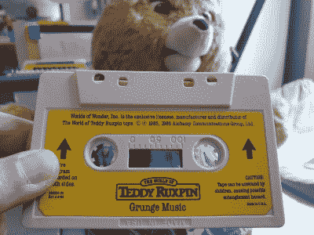](https://hackaday.com/wp-content/uploads/2022/07/grunge.jpg) 与此同时，我决定再拿一盘磁带来证明这是泰迪的问题，于是我拿到了现有的最好的泰迪·鲁克斯平磁带:垃圾音乐。

维基百科会告诉你,[这个描述 90 年代早期西雅图音乐场景的术语](https://en.wikipedia.org/wiki/Grunge#Origin_of_the_term)来自一个唱片公司高管对一个乐队声音的描述，但我真诚地相信它是通过这盘磁带进入那个人的潜意识的，它参考并采样了泰迪熊宇宙中一类被称为 Grunges 的生物制作的音乐。不知何故，这盘磁带听起来甚至比恶魔泰迪的夏季版还要好。

你们当中精明的人已经注意到磁带是颠倒的，我想这是因为播放头和控制泰迪眼睛和嘴巴的伺服系统之间的电线较短，尽管这可以作为区分泰迪磁带和 maxi cassingles 的一种简单方法。更有趣的是，在磁带的顶部有第二组复制保护窗口。我想这能告诉泰迪这带子是他的，还是其他生锈的带子。

  Back: normal tape. Front: Teddy tape.  If you look closely, you can see a little switch actuator lined up with the left hole. [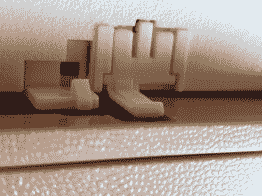](https://hackaday.com/2022/07/21/teardown-how-many-teddy-ruxpins-does-it-take-to-start-a-coven/20220708_163337/) Here is the switch actuator in the light, on the left. There are two holes because the program is recorded on both sides. [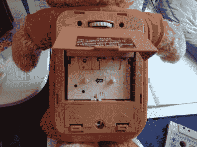](https://hackaday.com/2022/07/21/teardown-how-many-teddy-ruxpins-does-it-take-to-start-a-coven/20220708_163432/) Here’s the back of the bear. [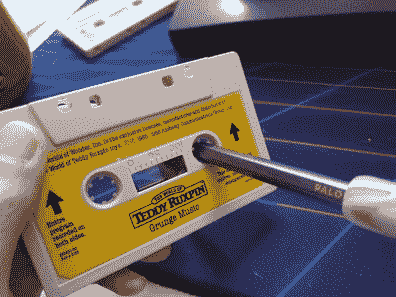](https://hackaday.com/2022/07/21/teardown-how-many-teddy-ruxpins-does-it-take-to-start-a-coven/20220708_164137/) Teddy has no audio or playback controls other than the switch on-volume pot at the top there, so you gotta rewind cassettes the old-fashioned way.

## 拆卸时间

[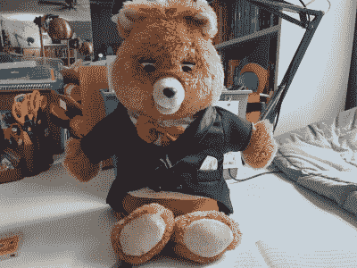](https://hackaday.com/wp-content/uploads/2022/07/Teddy_Tuxpin.jpg)

Teddy Tuxpin is a lounge singer by night. He had an act with Mac Tonight back in the 70s before they took separate paths to overnight success.

真的没多久我就喜欢上了这只恶魔般的夏日泰迪熊，以至于我买了第二只来做真正的拆卸工作。我真的不认为在那些螺丝下面有什么可怕的，但我想在给 Hula Teddy 动手术之前有机会熟悉一下它的内部结构。

总之，这是我搞砸的地方。我想通过泰迪录制垃圾音乐，但出于某种原因，我决定开始拆除螺丝，现在磁带不再移动了。

与此同时，泰迪·图斯潘出现了，他工作得很好。所以现在，我能做的就是通过泰迪·图斯潘录制垃圾音乐:

<https://hackaday.com/wp-content/uploads/2022/07/TT_Grunge_Music.mp3?_=3>

[https://hackaday.com/wp-content/uploads/2022/07/TT_Grunge_Music.mp3](https://hackaday.com/wp-content/uploads/2022/07/TT_Grunge_Music.mp3)

下面是垃圾音乐在凯蒂猫中的声音:

<https://hackaday.com/wp-content/uploads/2022/07/TT_Grunge_HK.mp3?_=4>

[https://hackaday.com/wp-content/uploads/2022/07/TT_Grunge_HK.mp3](https://hackaday.com/wp-content/uploads/2022/07/TT_Grunge_HK.mp3)

然后，我有了一个主意:再买三个泰迪熊，把它们都黑掉，让它们听我的，让它们唱理发店四重奏。我甚至可以为他们缝制小的配套服装。但是我跑题了。

由于泰迪·图斯潘工作得很好，我犹豫着要不要把他打开，可能会用其他的一个进入里面。我骗了一点点，发现了这个惊人的 Web 1.0 网站，它以类似于海报板的格式提供详细的拆卸信息。塑料盒顶部有两个深陷的十字螺丝，还有两个微小的软金属螺丝，非常容易拆卸。我已经尝试过其中一个，但失败了，然后我四处张望，以确保这就是进去的全部内容。

## 但是等等，还有更多

在我从网上收集泰迪熊的狂热中，我也买了一个新的泰迪熊。Playskool/Hasbro 在 1991 年至 1996 年间制作了这些泰迪熊，它们使用的盒式磁带看起来很像小的 8 声道。这只特殊的熊带有一个 1992 年的弹夹。不是四个 C 电池，而是四个 AAs，强烈建议使用碱性电池。一切都变小了，包括泰迪自己。

 [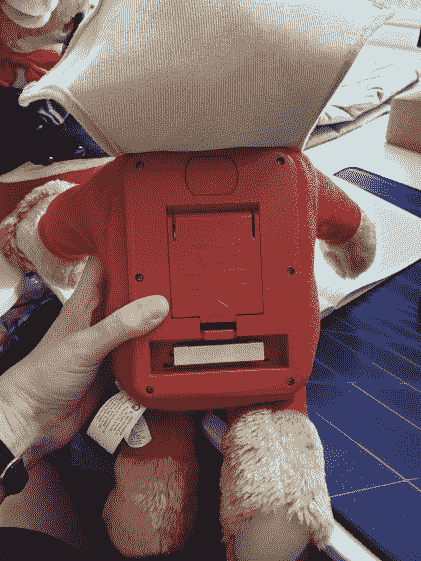](https://hackaday.com/2022/07/21/teardown-how-many-teddy-ruxpins-does-it-take-to-start-a-coven/binary-comment-48/) The controls are even simpler. [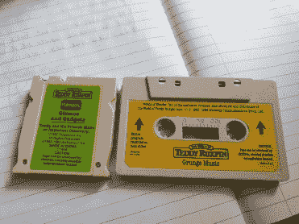](https://hackaday.com/2022/07/21/teardown-how-many-teddy-ruxpins-does-it-take-to-start-a-coven/binary-comment-49/) Tiny 8-track is tiny. [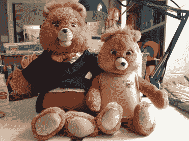](https://hackaday.com/2022/07/21/teardown-how-many-teddy-ruxpins-does-it-take-to-start-a-coven/binary-comment-50/) The snout seems a bit longer on Junior there.

在 8 轨泰迪熊之后，第三代普通卡带出现了短暂的复苏。然后他们转向了数码墨盒。泰迪在 2017 年抛弃了[剃须刀和刀片的商业模式](https://en.wikipedia.org/wiki/Razor_and_blades_model)，并且预装了三个故事。其他故事可以通过应用程序获得。哦，这一次，泰迪有一些严重令人毛骨悚然的液晶眼睛。如果你真的想进入泰迪时间线，[这次穿越泰迪鲁斯平金库](https://www.cnet.com/pictures/teddy-ruxpin-the-original/34/)的旅行是一个很好的开始。

## 回到 8 轨泰迪

根据封面内侧的建议，我找出了四节明显不含碱性的电池来测试他。虽然 8 声道的泰迪听起来不错，但他的眼睛和嘴巴都没有动。虽然原泰迪出生时头部有三个伺服系统，但我听说新版本使用了一个伺服系统，所以它可能只是死了或冻结了。

嗯，第二次看电池盒里面，它说如果泰迪熊不能正常活动，你应该插入新电池，强烈建议使用碱性电池。有这么简单吗？我用的可充电电池只有 1.2 伏。我出去买了些新的铜陀螺，92 年的泰迪熊还是不动。我想这是因为他的鼻子歪了——也许他被摔了太多次脸朝下，或者脸朝下撞到了什么东西上。我得看看我能不能修好它。

同时，让我们进去看看，好吗？

 [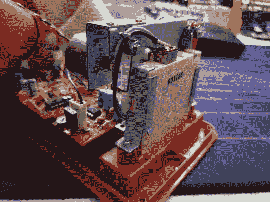](https://hackaday.com/2022/07/21/teardown-how-many-teddy-ruxpins-does-it-take-to-start-a-coven/binary-comment-52/) The mini 8-track player. Tapes are ka-chunked into the base of Teddy’s spine like an epidural instead of inserting flat against his back. [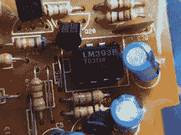](https://hackaday.com/2022/07/21/teardown-how-many-teddy-ruxpins-does-it-take-to-start-a-coven/binary-comment-53/) The second-biggest chip on the board: a comparator. [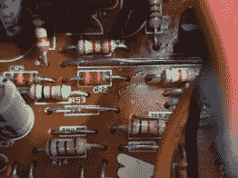](https://hackaday.com/2022/07/21/teardown-how-many-teddy-ruxpins-does-it-take-to-start-a-coven/binary-comment-54/) What the heck is this diode-looking thing? CR? There are five total. [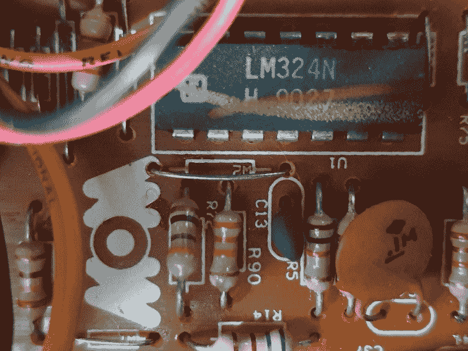](https://hackaday.com/2022/07/21/teardown-how-many-teddy-ruxpins-does-it-take-to-start-a-coven/binary-comment-55/) Wow indeed — the biggest chip on the board is an op-amp.

## 记住，这还没有结束

我没必要告诉你把东西拆开后感觉的变化。你知道，仅仅看到事物的内部会让你更加熟悉，以至于你再也不会以同样的方式看待外部。

那么我小时候害怕会说话的熊呢？我必须说，恶魔般的夏日泰迪只给我带来了快乐，我决心让他再次吟唱，这样我就可以恐吓其他人了。我已经给他买了一件更好的夏威夷衬衫，有几个洞和污渍，所以这种情况必须发生。但它将不得不发生在另一个职位，我敢肯定，这将是一个真正的泰迪熊野餐。

我要感谢 Elliot 的[非互联网](https://hackaday.com/2022/07/02/not-on-the-internet/#comments)帖子上的所有评论者，他们为我指出了如何制作泰迪熊问题的各种答案，例如[这个用于制作新泰迪熊磁带的 GUI 创作工具](https://github.com/furrtek/Svengali/)和[这个关于内部工作方式的旧新闻组帖子](https://web.archive.org/web/20190922045015/http://www.mindspring.com/~mathue/workings.html)。我一定会比以前走得更远。