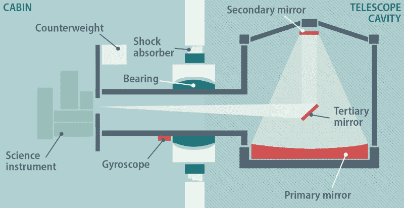

# 美国国家航空航天局的飞行望远镜正在逐步减少操作

> 原文：<https://hackaday.com/2022/07/11/nasas-flying-telescope-is-winding-down-operations/>

美国宇航局的哈勃太空望远镜可以说是历史上最著名和最成功的天文台，提供了前所未有的图像，这些图像已经吸引了公众和天文学家 30 多年。但即便如此，哈勃也没有什么特别之处。最终，它只是一个大型光学望远镜，它的好处是在太空中，而不是在地球表面。事实上，长期以来人们一直认为哈勃与国家侦察办公室操作的当代间谍卫星没有什么不同——只是指向了不同的方向。

然而，在美国宇航局的观测武器库中，有一些真正独特的仪器，尽管它们可能没有哈勃或詹姆斯·韦伯太空望远镜的名气大，但它们仍然代表着令人难以置信的工程技术。最好的例子可能是平流层红外天文观测台(SOFIA ),这是一架安装在退役客机上的机载红外望远镜，是真正独一无二的。

不幸的是，这种独特的空中望远镜操作起来非常昂贵；它的年运营成本约为 8500 万美元，是该机构最昂贵的持续天体物理任务之一。经过 12 年的观察，美国宇航局和他们在德国航空航天中心的合作伙伴已经决定在 9 月份索菲亚计划结束后终止该计划。

随着望远镜如此接近进行最后的观察，这似乎是一个很好的时间来回顾这个令人难以置信的计划，以及为什么美国和德国航天中心决定是时候把索菲亚放回机库。

## 天空之眼

通过在大约 12 公里(40，000 英尺)的高度飞越平流层进行天文观测，索非亚在字面上和比喻上都是地面望远镜和空间望远镜之间的中间地带。它的工作高度意味着望远镜高于绝大多数大气水蒸气，否则水蒸气会阻止某些红外频率到达地球表面，而它定期维修和升级的能力使它具有通常与地面天文台相关的科学灵活性。

索非亚计划的关键是一架足够大的飞机来携带望远镜，连同它的仪器和操作它的人员，直到稳定、长时间飞行所需的高度。在这种情况下，它是一架波音 747SP 宽体客机，最初于 1977 年由泛美航空公司开始其职业生涯。

这种标志性的 747 的特殊“SP”变体是专门设计来飞得更远、更快、更高的，方法是移除机身的一部分并进行其他减重修改。专为纽约和中东之间的航班制造的数量相对有限，用于索非亚的机身是仅存的四架仍在飞行的 747SPs 之一。

为了携带 17 公吨(38000 磅)的望远镜，747SP 需要进行相当大的结构修改，但肯定没有比在飞行中可以打开以露出 2.7 米(8.8 英尺)主镜的大门更明显的了。为了防止门打开时的风涌入，这将在光学系统中引入不可接受的振动，机身后部增加了一个明显的“驼峰”，以在高速气流撞击开口之前改变其方向。一些湍流空气不可避免地会进入室内，但可以通过使用望远镜的支架进行补偿，该支架使用加压油轴承、配重、陀螺仪和磁力矩马达的组合来稳定和瞄准仪器。

## 强大的竞争

索非亚望远镜是迄今为止安装在飞机上最大的望远镜，这个记录几乎肯定不会被打破。尽管如此，它的主镜与詹姆斯·韦伯太空望远镜(JWST)的 6.5 米(21 英尺)反射镜相比还是相形见绌，詹姆斯·韦伯太空望远镜是美国宇航局的新旗舰红外望远镜，距离上线只有几天了。虽然很难直接比较这两个天文台及其能力，但毫无疑问，JWST 代表了红外天文学的未来。与此同时， [SOFIA 在过去的几年里受到了批评](https://www.nature.com/articles/d41586-020-00685-2),因为相对于其高昂的开发和运营成本，它能够收集的科学数据太少。

虽然 JWST 在很大程度上让索菲亚变得多余，但这并不是说科学界不会哀悼它的损失。SOFIA 不仅能够观测更宽范围的红外频率，而且其瞄准月球的独特能力直接导致了 [2020 年在阳光照射的月球表面确认有水](https://www.nasa.gov/press-release/nasa-s-sofia-discovers-water-on-sunlit-surface-of-moon)。随着时间的推移，它还可以升级，以利用今天可能甚至不存在的仪器进行观测，而 JWST 距离地球太远，永远不会像哈勃那样获得这种增量升级。

简而言之，像索非亚这样的天文台是很有必要的。但是，除非美国宇航局能够找到一种更便宜的方法来建造和运行它，否则它可能是一个无法实现的科学利基。