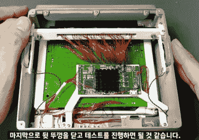

# SF1 Mini 是一款不知名的任天堂游戏机的自制版本

> 原文：<https://hackaday.com/2022/07/08/the-sf1-mini-is-a-homebrew-version-of-an-obscure-nintendo-console/>

超级 NES 可以说是 16 位时代最著名的游戏机。它通常以灰色盒子的形式出现，带有灰色或紫色的按钮，以及棱角分明或流线型的设计，这取决于你是住在北美、欧洲还是亚洲。随后推出了紧凑型和迷你版，但在 20 世纪 90 年代初 SNES 的全盛时期，也发布了一些不太知名的车型。其中之一是夏普 SF1:一台内置超级任天堂的 CRT 电视。盒式磁带插槽位于顶部，控制器连接在前面。内部视频连接甚至提供了比典型的 SNES 设置更好的图像质量。

Some light soldering required.

SF1 从未在日本以外销售过，现在非常罕见。但是，即使你能找到一个，笨重的阴极射线管会占用你家很多空间。[Limone]因此决定[为自己建造一个更小的复制品来代替](https://www.youtube.com/watch?v=HT7W5ygC1vk)。他的“SF1 mini”装在一个 3D 打印的盒子里，里面有一个 5.5 英寸的 TFT 屏幕，立体声扬声器，以及游戏包和游戏垫的连接。

谢天谢地，[Limone]没有牺牲一个原始的 SNES 来制作这个项目:相反，他使用了一个由名为 Columbus Circle 的公司开发的 DIY 超级任天堂套件。这个工具包包含一个 SNES 主板的现代复制品，并打算像这样的自定义构建。然而，主板的布局并不符合[Limone]的预期设计，所以他拆下几个组件，并使用一个巨大的磁线网重新连接它们。RGB 到 HDMI 转换器将 SNES 的视频输出连接到 TFT 屏幕，并提供非常清晰的图形。

[Limone]在下面嵌入的视频中详细解释了构建过程(韩语，有英语字幕)。我们已经看到了几个整洁的 SNES 复制品，[一些小的](https://hackaday.com/2017/11/15/homebrew-snes-mini-aims-for-historical-accuracy/)和[一些特别小的](https://hackaday.com/2016/09/11/snes-micro-is-a-pi-z-of-art/)，但这必须是第一个 SF1 复制品。

 [https://www.youtube.com/embed/HT7W5ygC1vk?version=3&rel=1&showsearch=0&showinfo=1&iv_load_policy=1&fs=1&hl=en-US&autohide=2&wmode=transparent](https://www.youtube.com/embed/HT7W5ygC1vk?version=3&rel=1&showsearch=0&showinfo=1&iv_load_policy=1&fs=1&hl=en-US&autohide=2&wmode=transparent)

感谢来自 [Hackaday Discord 服务器](https://discord.gg/NkbHrAW7NG)的【CatfaceMcMeowMeow】提供的提示！