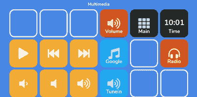
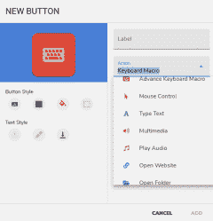
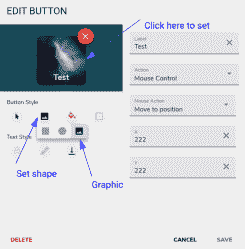

# 快速破解:手机到流媒体工具的转换

> 原文：<https://hackaday.com/2022/07/18/quick-hack-the-phone-to-stream-deck-conversion/>

你用那些旧的安卓或 iPhone 手机和平板电脑做什么？您有很多选择，但是用一些现成的软件来构建自己的 stream deck 是相当容易的。你会问，什么是溪流甲板？这个名字来自于它作为直播设置的控制器的用途，但本质上，它是一个液晶触摸屏，可以触发你电脑上的事情。

我正在使用的软件是一个用于 Windows 或 Linux 的服务器，当然还有一个 Android 应用程序。该应用程序是免费的，但有一些限制，但你可以花不到 4 美元购买完整版。然而，即使是免费版也相当能干。你可以使用 Android 手机或平板电脑，也可以通过 USB 线或 WiFi 连接到 PC。我发现，即使有 WiFi，给手机充电也很方便，所以实际上你会有一根电缆，但不一定要连接到主机上。

## Linux 设置

设置非常简单。最大的障碍是你可能需要设置你的防火墙来允许服务器通过 TCP 监听端口 8500。在安装 Linux 时，您可能需要注意一些小问题。有`deb`、`tar.gz`和 appimage 格式的 32 位和 64 位版本。还有一个抓拍。snap 的问题是它是沙盒化的，所以不努力你就不能轻松地启动程序，这是关键所在。最后我把它移除了，安装了 deb 文件，这样就好了。

还有另外两条皱纹。首先，虽然 Deckboard 提供了一种启动程序的方法，但它必须是从系统中读取的列表中的程序。这是可以接受的，但是清单并不完整。我从来没有弄明白为什么有些东西会出现在清单上，而有些不会。例如，我的应用程序菜单上显示的 GIMP 就不见了。然而，其他一些相当模糊的东西确实出现了。

我认为这可能是一个 dealbreaker，直到我发现 Deckboard 有一个开发良好的插件系统，其中一个插件可以让你运行任意命令行。我想这是有点不方便，但它更灵活，因为你可以启动任何你想要的程序，并提供选项。

我唯一的其他抱怨是，当你运行程序时，它显示其配置界面，并把自己放在系统托盘中。这在第一次运行时很好，但是在系统启动时，让它安静地启动会更好。如果有选择的话，我还没找到。稍后我会告诉你我是如何解决这个问题的，但是，现在，你就忍着吧。

## 配置

当然，在两台机器上都安装它只是开始。这类东西的全部意义在于根据您的喜好对其进行配置。该程序知道如何与 OBS、Spotify、Twitter 和 Twitch 通信。但是您也可以添加通用程序、URL 等等。还有像 Discord，Open Hardware Monitor，Steam 等等的插件。

[](https://hackaday.com/wp-content/uploads/2022/07/media.png)

The multimedia panel lets me control media and open a few apps

你可以创建一堆页面，这样你就不必把所有东西都塞在一个页面上。免费版限制了你在一个页面上可以有多少个按钮，但是升级版可以让你想放多少就放多少。我发现我的旧 Pixel 2 XL 在横向模式下有三排 6 个按钮，对我来说很合适。

当然，每个人对如何设置会有不同的想法，你可能比我更有能力创造出有美感的东西。然而，我试图保持一些事情不变。每个屏幕的右上角是一个时间按钮，不做任何事情，只是显示时间)。这需要一个插件。顶行的其余部分是为打开其他页面的按钮保留的，在除主屏幕之外的每个屏幕上，时钟旁边的按钮带你回到主屏幕。

[](https://hackaday.com/wp-content/uploads/2022/07/newbutton.png)

Creating a new button is easy enough

每个屏幕右下角的按钮可以打开一个多媒体面板，因为它实在是太有用了。同样，你不会喜欢我的设置，你会想要自己的。

在 PC 上创建按钮和页面非常容易。您可以选择从键盘宏到多媒体控制的各种操作。可以控制鼠标，打开网站，或者截图。当然，你也可以像我前面提到的那样运行一个程序。

## 形式和功能

[](https://hackaday.com/wp-content/uploads/2022/07/graphic.png)

Graphic buttons can make your deck look better but getting there isn’t obvious

我承认，我的纽扣有点乏味。图标内置在程序中，来自字体真棒。然而，我没有意识到你可以让每个按钮使用你自己的自定义图形。你可以通过选择按钮的形状来做到这一点，按钮的形状可以是方形、圆形，或者看起来像图像的神秘的第三个选项。起初，我认为这只是意味着“完全透明”，但如果你选择它，然后按下编辑窗口中的按钮，它会让你选择一个文件作为背景。既然我知道了，我想我得重新配置一切。

一个好处是你可以让一个按钮做多种动作。例如，当我按下 Hackaday 按钮时，它不仅会切换到桌面上的 Hackaday 页面，还会通过发送键盘命令来翻转到我在 PC 上的 Hackaday 桌面。它也可以运行脚本或文件夹。

[](https://hackaday.com/wp-content/uploads/2022/07/hadbutton.png)

Buttons can run more than one action

它不完全是一种脚本语言，但是在某些情况下，它可以防止您将按钮绑定到 bash 脚本上。

## 最后一块

我提到过，我没有意识到在启动时加载程序也会导致主窗口出现。我找到了一个相当简单的方法来解决这个问题，至少在 KDE 是这样。首先，最小化运行程序。你可以用几种方法做到这一点。我使用了一个 KWIN 窗口规则来强制它图标化，但是你也可以使用`kstart`来做这件事。当然，如果你不使用 KDE，你将不得不寻找另一种方法来做到这一点，老实说，如果你不介意在启动时看到配置屏幕弹出一点，这真的没有关系。这是因为除了将程序设置为自动启动，我还启动了一个名为`deckboard-tidy.sh`的脚本文件:

```

#!/bin/bash
sleep 5
wmctrl -c deckboard

```

换句话说，等待程序启动，然后关闭它的窗口。它仍然在系统托盘中运行。您也可以告诉 Deckboard 不要加载自己，然后在这个脚本中完成整个加载操作。你也许可以在其他桌面上玩同样的把戏，但是细节将取决于你的设置。

老实说，这是一个有用大于困难的黑客。但是你可以花很多时间来调整这个完美的设置。但它让那部旧手机变成了你每天都可以使用的东西。

如果你喜欢更严格的黑客攻击，请查看 [FreeDeck](https://hackaday.com/2020/07/09/open-source-stream-deck-does-it-without-touch-screens/) 。不是说那是[唯一一个在那里的](https://hackaday.com/2021/08/24/sparkpad-sparks-joy-for-streamers/)。如果你想要一个真正有用的黑客，这将是很好的逆向工程 Deckboard 的 TCP 协议，所以我们可以有一个树莓 Pi 服务器。