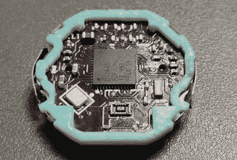

# 你从未拥有过的卡西欧智能手表

> 原文：<https://hackaday.com/2022/07/20/the-casio-smartwatch-you-never-had/>

在某种程度上，你不得不为卡西欧的工程师感到有点遗憾。他们可以生产有史以来最先进的数字手表来装饰手腕，但他们的工作将永远与他们更低级的创作联系在一起。卡西欧 F91 是典型的数字手表——它价格实惠，从方舟时代就开始生产，它做得非常好，已经成为设计经典，而且它仍然是一个很难效仿的行为。

 如果说 1989 年的手表有什么缺点的话，那就是它的功能非常基本。如果一款卡西欧 F91 能成为现代智能手表该多好啊！多亏了[Pegor],它可以通过[对经典手表的内部结构](https://gitlab.com/_Pegor/kepler_fw)进行彻底改造。现在，这款简单的经典时计已经完全更新换代了！

卡西欧的所有内部零件都被移除，一个新的机芯支架支撑着一个新的 PCB，有机发光二极管显示器通过一个柔性子 PCB 安装。大脑由德州仪器 CC2640 BLE 微控制器提供。这给了它 15 天的电池寿命，这与原始手表完全不同，但比智能手表好。他承认软件需要一些工作，但对于如此出色的硬件，我们希望其他人能做出一些改进。

这可能是我们见过的最令人印象深刻的 F91 黑客，但[它绝不是我们向你展示的第一个改进的卡西欧](https://hackaday.com/2016/05/30/gutting-and-rebuilding-a-classic-watch/)。