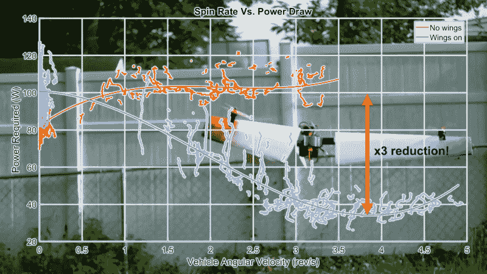

# 将无人机变成大型螺旋桨，提高悬停效率

> 原文：<https://hackaday.com/2022/07/24/turn-drone-into-a-large-propeller-to-increase-hover-efficiency/>

多旋翼无人机明显比传统直升机设计更受欢迎，原因有很多，其中不包括效率。利用这背后的空气动力学效应，[Nicholas Rehm]能够通过将它变成一个大型旋转螺旋桨来显著提高他的实验性三翼飞机的效率。

由于空气阻力与速度成正比，一个小的高转速螺旋桨需要更多的动力才能产生与大的低转速螺旋桨相同的推力。考虑到这一点，[尼古拉斯]建造了一架三翼飞机，它可以使用一个单一的伺服系统一起旋转所有三个长臂，使其具有非常积极的偏航控制。通过在每个臂上安装一个机翼，它就变成了一个由翼尖推进器驱动的大型变距螺旋桨。

为了测量飞行器的效率，增加了一个小型激光雷达传感器，以实现精确的 PID 高度控制。当无人机保持在离地面几英尺的恒定高度时，[Nicholas]测量了悬停时电机的功率消耗，然后让无人机绕着它的偏航轴旋转，速度接近 5 转/秒。

在转速为 4 转/秒时，电动机的功率消耗减少了 60%以上。即使与没有增加机翼重量的无人机相比，它仍然使用了 50%的电力来保持高度。

由于[Nicholas]在旋转时还没有实现水平位置控制，所以每次试运行的长度受到了风漂移的限制。他计划解决这个问题，并在水平飞行中对无人机进行一些测试，增加的机翼也将提高效率。

我们在 Hackaday 上展示了一些[Nicholas]的飞行器，包括一架[泡沫 F-35 垂直起降](https://hackaday.com/2021/07/15/foam-f-35-learns-to-hover/)和一架[循环直升机](https://hackaday.com/2021/08/06/cyclocopter-flies-with-eight-spinning-horizontal-wings/)。他的大部分飞机运行他的开源 [dRehmFlight](https://hackaday.com/2021/02/15/drehmflight-customizable-flight-stabilisation-for-your-weird-flying-contraptions/) 飞行稳定，专门为黑客创造。

 [https://www.youtube.com/embed/7JH1_ZKV7t4?version=3&rel=1&showsearch=0&showinfo=1&iv_load_policy=1&fs=1&hl=en-US&autohide=2&wmode=transparent](https://www.youtube.com/embed/7JH1_ZKV7t4?version=3&rel=1&showsearch=0&showinfo=1&iv_load_policy=1&fs=1&hl=en-US&autohide=2&wmode=transparent)

