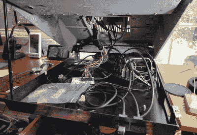

# 宠物停靠站已经有 20 年的历史了

> 原文：<https://hackaday.com/2022/07/22/pet-docking-station-was-two-decades-in-the-making/>

有一些项目曾经可能是完全合适的，但现在看来是亵渎。[戴夫·卢纳]在 Commodore Pet 64 箱子中的个人电脑坞站乍一看似乎是其中之一，但它不仅仅是毁掉一台珍贵的复古电脑。

 一个年轻得多的人【戴夫】有一只死去的宠物 64，因为二十多年前这种东西被认为是垃圾，他开始把它改装成电脑机箱。在所有雄心勃勃的项目中，它都停滞不前了，所以在 2022 年，他开始使用 Pet 64 的金属外壳和键盘，而不是完整的计算机。

箱子里有一个小的彩色 TFT 显示器，一个 USB3 集线器，一个 DisplayLink 适配器，还有一个 Arduino Micro 在做 Commodore 键盘的 USB 化工作。结果是一个非常酷的扩展坞，但他承认使用起来没有他想要的那么好。透过玫瑰色眼镜看，任何宠物在当时都是一台令人惊叹的机器，但在 4K 显示器的世界里，略显黯淡的键盘和小屏幕就不那么有吸引力了。尽管如此，我们的桌子上还是会有一个。

这只宠物出现在很多已经进入这些页面的项目中，例如展示 YouTube 视频的。

 [https://www.youtube.com/embed/8aGDmUnk1no?version=3&rel=1&showsearch=0&showinfo=1&iv_load_policy=1&fs=1&hl=en-US&autohide=2&wmode=transparent](https://www.youtube.com/embed/8aGDmUnk1no?version=3&rel=1&showsearch=0&showinfo=1&iv_load_policy=1&fs=1&hl=en-US&autohide=2&wmode=transparent)

