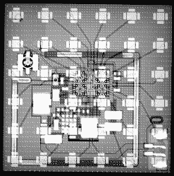

# 逆向工程相控阵系统揭示惊人的细节

> 原文：<https://hackaday.com/2022/07/21/reverse-engineering-a-phased-array-system-reveals-surprising-details/>

“相控阵”这个术语由来已久，但近年来，我们越来越多地听说相控阵天线可以实现波束成形。在中断下方的视频中，【信号路径】[分解了一个高通 60GHz WiGig 单元](https://www.youtube.com/watch?v=JI9fvAcNpdk)，并进行了深入研究，甚至查看了天线的裸硅和 x 射线。

An X-Ray of the antenna shows the intricate design

一些有趣的亮点包括如何不仅通过标准同轴电缆将数据信号发送到天线，而且控制信号和基本时钟频率也是如此。[信号路径]解释了制造商如何选择使用超外差(又名“超外差”)架构，这与传统业余无线电收发器中使用的架构并无太大区别。理论上是这样的。

讨论的另一个因素是 PCB 本身如何用作波导、电感和传输线匹配，以及其他无数的小技巧，以将一个相当复杂的系统装入一个真正的小空间。

如果你不熟悉相控阵背后的概念，请查看我们在 2019 年发表的这篇文章，这篇文章展示了[相控阵如何在没有任何移动部件的情况下操纵波束](https://hackaday.com/2019/01/11/no-moving-parts-phased-array-antennas-move-while-standing-still/)。挺让人着迷的！

 [https://www.youtube.com/embed/JI9fvAcNpdk?version=3&rel=1&showsearch=0&showinfo=1&iv_load_policy=1&fs=1&hl=en-US&autohide=2&wmode=transparent](https://www.youtube.com/embed/JI9fvAcNpdk?version=3&rel=1&showsearch=0&showinfo=1&iv_load_policy=1&fs=1&hl=en-US&autohide=2&wmode=transparent)

