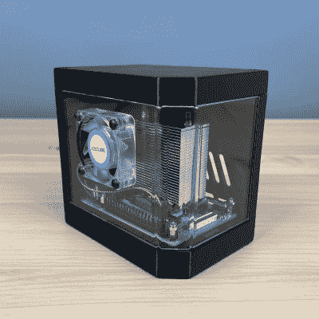

# 自定义树莓 Pi 案例展示了整个工作流程

> 原文：<https://hackaday.com/2022/07/25/custom-raspberry-pi-case-shows-the-whole-workflow/>

如果你是一个过程迷，并且喜欢从头到尾观察一件东西是如何制作的，使用什么工具，那么就看看 T2 展示他的覆盆子 Pi 盒子设计吧。他的箱子有很多看起来很酷的元素，并结合了 3D 打印以及激光切割和透明弯曲丙烯酸树脂，形成了华丽的四分之三视图。

 【迈克尔】的文章(以及附带的[视频](https://www.youtube.com/watch?v=i6RdNH_BwYc)，嵌入下方)部分是对他的 Creality 3D 打印机的回顾，部分是对他的 Raspberry Pi 外壳设计的展示(他在他的 Etsy 商店以很少的费用出售设计文件)。)但最重要的是看到最终产品中每一件作品的创作。不是每个人都熟悉这些工具的工作方式，或者它们能创造什么，所以很高兴看到这方面的关注。

博文和视频都很好地展示了每个部分的内容。视频以打开包装和设置 3D 打印机开始([如果你不感兴趣，请跳到 4:58](https://youtu.be/i6RdNH_BwYc?t=292) )，然后打印零件，在 [K40 激光切割机](https://hackaday.com/2018/09/27/laser-noob-getting-started-with-the-k40-laser/)上激光切割丙烯酸树脂，使用小型手动工具弯曲丙烯酸树脂，最后组装一切。出于好奇，也有他使用的确切部件和设备的链接。

就像我们说的，这是 3D 打印机审查的一部分，也是他出售的设计的一部分，但很高兴看到每个部分都被创建出来，看到工具被使用，并看到结果汇集在最终产品中。你想去相反的方向吗？[只需一台 3D 打印机就能为你的树莓派打造一个一体式简约包](https://hackaday.com/2020/08/11/folding-raspberry-pi-enclosure-prints-in-one-piece-no-screws-in-sight/)。

 [https://www.youtube.com/embed/i6RdNH_BwYc?version=3&rel=1&showsearch=0&showinfo=1&iv_load_policy=1&fs=1&hl=en-US&autohide=2&wmode=transparent](https://www.youtube.com/embed/i6RdNH_BwYc?version=3&rel=1&showsearch=0&showinfo=1&iv_load_policy=1&fs=1&hl=en-US&autohide=2&wmode=transparent)

