# 用沙滩球保护休斯 H4 大力士队？

> 原文：<https://hackaday.com/2022/07/26/protecting-the-hughes-h4-hercules-with-beach-balls/>

[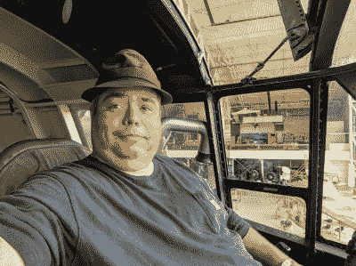](https://hackaday.com/wp-content/uploads/2022/07/VeryHappyAvGeek.jpg)

周末在美国俄勒冈州麦克明维尔参观长荣航空&太空博物馆时，我遇到了一个黑客。

除了现场出色的展示和可以反复观看视频的区域，博物馆还以非常合理的价格提供导游服务。正是在这次旅行中，我作为一名航空极客的生活永远改变了。为什么？我参观了 H4 号的飞行甲板，甚至坐在了霍华德·休斯驾驶飞机的座位上，差不多 75 年前他就是坐在这里的。

后来在旅程中，在我花了一点时间去体会坐在座位上的巨大感受后，我发现了一个很棒的窍门与大家分享:都是关于沙滩球的。

## 历史

休斯·H4·赫拉克勒斯可能更为人所知的是“云杉鹅”,尽管它大部分是由桦木制成的。休斯·H4·赫拉克勒斯是[霍华德·休斯](https://en.wikipedia.org/wiki/Howard_Hughes)的大脑产物，是一个古怪但有才华的工程师、飞行员和商业大亨。H4 是一项几乎令人难以置信的事业:它比当时任何一架飞机都要大，都要强劲。它不是由战争期间短缺的铝制成，而是由一种叫做 Duramold 的新型复合材料制成。

几年前，杜拉霉被发明并授权给休斯用于大力神项目。Duramold 由多层浸有树脂的桦木或杨木制成。Duramold 在当时被认为是一项技术壮举，考虑到 75 年后木材仍然完好无损，它显然是这样的。尽管在建造大力神时使用了几千磅的钉子，但一旦树脂固化，它们就可以被移除。

休斯正在制造迄今为止最大的飞机。大力神的失败，无论是什么性质的失败，都将是灾难性的。不仅仅是对飞机，而且对霍华德·休斯本人的声誉也是致命的打击，他已经因为生产一架木制飞机而受到了很多批评。他的项目的反对者给了他无尽的困难，他甚至被拖到了参议院面前，在观众面前他发誓如下:

> “大力神是一项不朽的事业。这是有史以来最大的飞机。它有五层楼高，翼展比一个足球场还长。这比一个街区还多。现在，我把我一生的汗水都倾注在这件事上。我把我的名声都卷进去了，我已经声明好几次了，如果它失败了，我可能会离开这个国家，再也不回来。我是认真的。”霍华德·休斯

## 沙滩球侵入了

所有这些重量都压在飞机工程师和建造者的肩上，人们不需要太多的想象力就能把自己放在 1940 年代的工程师的脑海中:有人不确定浮筒是否能保持防水，在一次紧张的会议中，也许一位年轻的工程师想起了他周末的家庭出游，并喊道“沙滩球！”很可能这次会议之后是去当地的商店，那里的货架上所有的沙滩球都空了，在下一批货到来之前，去海滩的孩子和大人都很失望。沙滩球充气后落入浮桥，确保浮桥不会进水，即使它们漏水。

结果如何？休斯让记者们在 H4 号上满载而归，并乘坐快艇进行了两次滑行，然后返回码头。一些记者离开了，急切地想得到这个大新闻的独家新闻，却发现大力神又开始了历史性的飞行。

## 成功！

[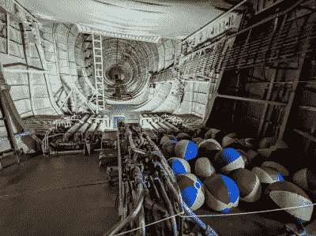](https://hackaday.com/wp-content/uploads/2022/07/SpruceGooseBeachBalls.jpg)

Beach balls on display in the cargo area

历史记载休斯飞行的短距离跳跃是如此大型飞机的突破性飞行。沙滩球拯救了世界吗？很难知道。

今天，沙滩球仍然保持着空气，表面上和大约 75 年前充气时一样。它们提醒人们，H4 只是一个原型，而不是最终产品。这也有助于我们记住，从古至今，各种类型的工程师都有一个共同点:他们都喜欢好的黑客技术！

在这次旅行中还收集了许多其他细节，包括在短暂的跳跃中尾部几乎与机身分离的事实——如果休斯飞得更久，坠毁将不可避免！在下面的照片中寻找加强的尾部。

如果你有机会去美国麦克明维尔的[常青航空&太空博物馆](https://www.evergreenmuseum.org/)，那就去吧。开始旅行，坐在座位上，体验历史。感受引擎在海风中翻腾的隆隆声。闻闻咸咸的空气，你就会知道你的飞机庞然大物拥有历史上其他飞机没有的东西:沙滩球。

 [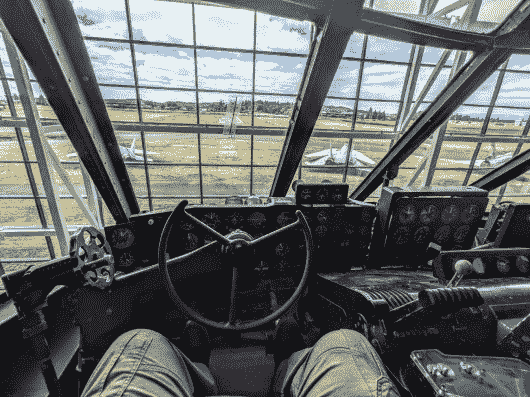](https://hackaday.com/2022/07/26/protecting-the-hughes-h4-hercules-with-beach-balls/thepilotsview/) Yes, I got to advance the throttles. [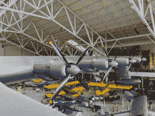](https://hackaday.com/2022/07/26/protecting-the-hughes-h4-hercules-with-beach-balls/sprucegoosepontoon/) The Pontoon from can be seen on the outboard section of left wing [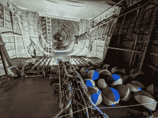](https://hackaday.com/2022/07/26/protecting-the-hughes-h4-hercules-with-beach-balls/sprucegoosebeachballs/) Beach balls and fire supression [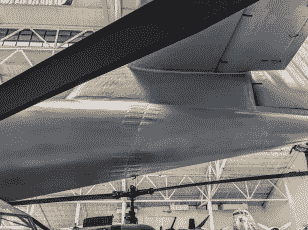](https://hackaday.com/2022/07/26/protecting-the-hughes-h4-hercules-with-beach-balls/sprucegoosetailfix/) Where the tail was repaired [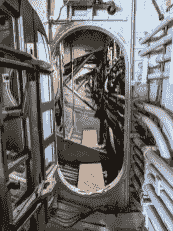](https://hackaday.com/2022/07/26/protecting-the-hughes-h4-hercules-with-beach-balls/sprucegoosewingwalker/) The view from the flight deck down the starboard wing [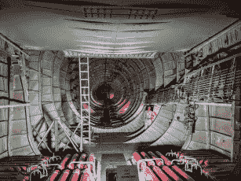](https://hackaday.com/2022/07/26/protecting-the-hughes-h4-hercules-with-beach-balls/sprucegooseaft/) The door in the far end of the aircraft is 5 feet tall [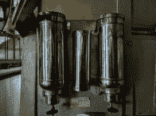](https://hackaday.com/2022/07/26/protecting-the-hughes-h4-hercules-with-beach-balls/sprucegoosecoffee/) Howard Hughes loved coffee too, apparently. [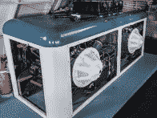](https://hackaday.com/2022/07/26/protecting-the-hughes-h4-hercules-with-beach-balls/sprucegooseapus/) The dual APU’s for getting the first engine started. [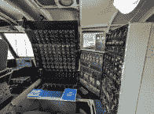](https://hackaday.com/2022/07/26/protecting-the-hughes-h4-hercules-with-beach-balls/sprucegoose-flightengineer/) The Flight Engineers station [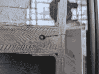](https://hackaday.com/2022/07/26/protecting-the-hughes-h4-hercules-with-beach-balls/sprucegoose-duramold/) Nine layer resin impregnated Duramold, an early composite