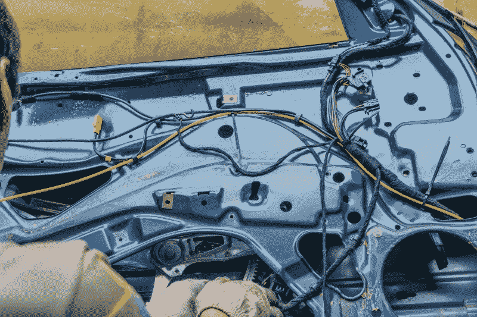
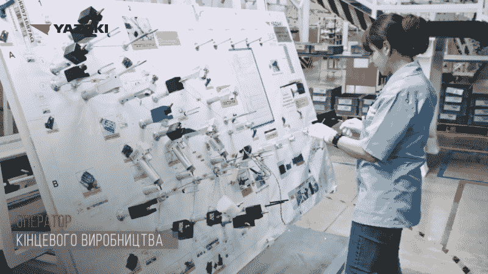

# 令人惊讶的手工制造汽车线束的过程

> 原文：<https://hackaday.com/2022/07/27/the-surprisingly-manual-process-of-building-automotive-wire-harnesses/>

甚至从汽车时代的最早期开始，轿车和卡车就是机械和电气设计的混合体。对于每个在气缸中上下滑动的活塞来说，都有一个火花塞需要在正确的时间点火，以使发动机工作，踩下制动踏板最好能在液压将车轮转子夹在刹车片之间的同时使刹车灯亮起。

没有电气连接，一辆有用的汽车实际上是不可能的。甚至早在电力开始成为车辆的首选燃料之前，连接运行车辆系统所需的计算机、传感器、致动器和指示器的电线就变得越来越复杂。在发动机和车架之后，汽车的线路和电子设备是第三大最昂贵的部件，据估计，到 2030 年，汽车平均成本的一半将锁定在电气系统上，而 2010 年这一比例为 30%。

确保所有这些信号到达它们要去的地方，并以安全可靠的方式这样做是汽车线束的工作，线束似乎占据了现代汽车的每个可能的区域。线束的设计和制造是一个复杂的过程，依赖于专门的软件、一定程度的自动化和惊人的人力。

## 比以往更多的电线

这篇文章的灵感来自于我和埃利奥特·威廉姆斯的一次谈话，以及他和一位开发汽车线束设计软件的工程师的一次聊天。我的第一个想法是，“有这样的软件吗？”紧接着是“当然有软件可以做到这一点！”。运行现代车辆所需的布线不是临时就能完成的——线束经过高度工程设计，既能满足电气方面的要求，又能适应机械方面的要求，不仅能适应可用空间，还能经受住在挑战性环境条件下使用几十年的严酷考验。

Just the wiring inside a door of a typical car today probably exceeds the complexity of an entire car’s wiring from just 30 years ago.

线束也必须作为单独的部件来制造。汽车和卡车制造越来越成为最后的组装过程，工人们在汽车下线时将合同制造商生产的零件安装到车架上。事实上，线束是最先添加到新生汽车上的部件之一，这不仅证明了它们对成品的重要性，也说明了如果以后需要维修，要接触到其中一些部件会有多么困难。

线束的设计与任何复杂的电路设计一样，都是从原理图开始的。在大多数现代汽车中，几乎所有的东西都与一个或几十个电子控制模块对话，这些模块分散在汽车各处，控制从点火正时和燃油喷射到 HVAC 控制和信息娱乐系统设置的一切。必须为每个 ECM 设计线束，为每个传感器和致动器提供电源和数据连接，考虑负载的电线尺寸，提供适当的接地连接，并确保使用正确的连接器。

## 跨维度设计

虽然线束的初始设计过程可以使用或多或少的标准 EDA 工具，但最终线束的二维示意图必须转换为车辆的三维结构。为了完成这项工作，需要使用更专业的 EDA 和 CAD 工具。这个世界上的一个大玩家似乎是 Dassault Systèmes 的 CATIA，它不仅拥有创建 2D 示意图所需的工具，还可以将其转换为车辆底盘的 3D 空间。这些工具允许设计人员创建线束，添加连接器，定义主线束的分支，设置每个线束的铺设路径，并寻找线束和车辆结构其余部分之间的任何冲突。它们还允许设计者指定电线如何捆绑在一起——例如，胶带缠绕与钢丝编织——以及线束将在何处以及如何连接到车辆。

线束的物理约束带来了另一个重要的设计考虑因素:松弛。在线束的每个束和分支中建立正确的松弛量至关重要。过多的松弛是一种浪费，不仅因为额外的电线需要铜，还因为额外的重量降低了燃油效率。由于车身或车架构件的磨损，或者由于绊在道路障碍物上或者甚至被乘客踩在上面，过度松弛也会导致安全带的物理损坏。松弛度不足也是一个问题——没有弹性的电线可能会随着车架的扭曲和弯曲而拉伸和断裂，而太紧的电线可能会使维修时难以松开连接器。线束 EDA 工具能够计算线束的正确松弛量，并在正确的位置放置压紧和约束，以确保电线弯曲足够，但不会太多。

一旦线束的 3D 模型最终确定，设计必须转化为可以制造的东西。由于用于线束的主要制造方法都依赖于钉板的使用——下文将详细介绍——辛苦的 3D 设计不得不展平成 2D 的图纸。CATIA 拥有自动化的展平工具，最终结果是一张 2D 图纸，其中详细说明了线束中每根电线的确切走向、它将在哪个连接器中的哪个引脚处终止，以及将在何处添加哪种附件，如固定夹、索环、电缆扎带或磨损保护套管。展平过程的输出代表一套完整的工作指令，可以发送给合同制造商。

 [https://www.youtube.com/embed/82RWg81p80U?version=3&rel=1&showsearch=0&showinfo=1&iv_load_policy=1&fs=1&hl=en-US&autohide=2&wmode=transparent](https://www.youtube.com/embed/82RWg81p80U?version=3&rel=1&showsearch=0&showinfo=1&iv_load_policy=1&fs=1&hl=en-US&autohide=2&wmode=transparent)

## 保持良好状态

随着几乎所有制造业的自动化，尤其是汽车制造业，成千上万的生产并不少见，你会认为线束制造必须完全自动化。毕竟，怎么能指望合同制造商跟上现代汽车工厂所需的线束数量，尤其是在精益方法和准时生产的情况下？肯定有大量的 CNC 机器使用工作指令放出电线并把它们捆在一起——对吗？

不对。在设计阶段之后，几乎所有的线束制造都是严格意义上的手工企业。事实证明，人类的灵巧性和眼手协调性真的是机器人难以企及的。线束工厂雇佣数千名工人手工组装几乎每一根线束。是的，有工具可以提供帮助，但大多数工具都是用来切割、剥离、端接和盘绕电线，最终将由人类工人用来制作线束，一次一根电线。

制作线束的传统方式是在钉板上。也称为模板或线束板，这实质上是一个大的平面，其上附有各种夹具，用于临时固定电线和连接器。夹具的布局代表了线束的扁平设计，印刷在电路板上的说明显示了哪些电线要布线到哪里。电路板通常垂直放置，稍微向后倾斜一点，以防止电线在固定之前脱落。

一个工人很少能做完整的线束。取而代之的是，一串相同的钉板在动力传送带上环绕工厂地板，缓慢而持续地从一个工人移动到下一个工人。在电路板移动到下一个具有不同任务集的工人之前，每个工人将一组特定的电线添加到不断增长的线束中。除了放置电线，一些工人还负责用电缆扎带固定线束，添加保护套管，或者用绝缘带包裹线束的各个部分。

正是这些精细的运动技能使得线束制造的完全自动化成为一个困难的命题。对于大多数人来说，将电线穿过一段塑料钢丝织机是一件微不足道的任务，但要制造一个机器人来完成这项任务却很困难。然而，值得注意的是，这是真的，主要是因为有很多人愿意为相对较低的工资做这样的工作。像 Yazaki 这样的公司目前占有全球线束生产市场的 30%,在世界各地雇佣了成千上万的员工，尤其是在发展中国家。经济力量目前倾向于继续这种模式，但正如我们一次又一次看到的那样，最终每个人都希望能够购买他们为他人制造的东西，因此愿意以低工资从事这种工作的工人供应是有限的。或许到那时，在线束生产链上投资全自动化是有意义的。