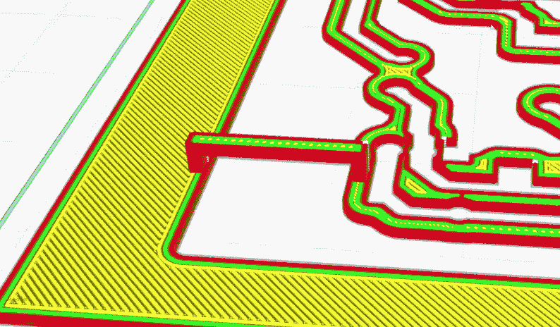

# 用 3D 打印机生产印刷电路板的新方法

> 原文：<https://hackaday.com/2022/07/26/a-new-way-to-produce-pcbs-with-your-3d-printer/>

随着黑客和制造商可以获得低成本的 PCB 制造服务，我们不得不承认，在家里制作自己的电路板不像过去那样有吸引力了。但是，即使专业制作主板比以往任何时候都更便宜、更容易，当你必须在一天结束之前拥有一个可用的主板时，在家制作仍然是无可匹敌的。

如果你发现自己处于这种情况，这个由[Adalbert] 详细介绍的 DIY PCB 生产的新方法可能正是你所需要的。这种独特的方法在其所有阶段使用桌面熔融沉积成型(FDM) 3D 打印机，从基于导出的电路板设计创建模板，到加热 UV 阻焊膜以加速固化过程。它可能不是具有精细间距元件的密集封装电路板的理想选择，但肯定会对许多原型有用。

Small “bridges” need to be manually added to hold the stencil together.

[Adalbert]通过张贴在 Hackaday.io 上的一步一步的指南出色地记录了这一过程，还整理了一段视频，休息后你可以看到。

但是如果你想找一个简短的版本，这个过程需要从你的 PCB 设计软件中取出一个 2D DXF，把它转换成三维，然后打印出来。然后将它放在涂有阻焊膜的覆铜板上，用紫外光源曝光。之后，异丙醇可以用来洗去未曝光的掩模，留下你的 PCB 设计。

你仍然需要化学蚀刻电路板，如果你使用通孔元件，手动钻孔。但是与一些老式的自己制作冲浪板的方法相比，这相对简单。这项技术看起来也有希望用于小规模生产，因为模板可以无限重复使用。

如果你的 3D 打印机是树脂类型的，不要担心，[你也可以用它们制作印刷电路板](https://hackaday.com/2020/10/09/put-that-new-resin-printer-to-work-making-pcbs/)。我们也看到了用廉价激光雕刻机生产的令人印象深刻的电路板[，以及](https://hackaday.com/2017/12/22/improving-cheap-laser-engravers-for-pcb-fabrication/)[廉价数控路由器](https://hackaday.com/2018/09/12/turning-a-cheap-engraver-into-a-decent-pcb-mill/)。

 [https://www.youtube.com/embed/QdvfGcdTSuA?version=3&rel=1&showsearch=0&showinfo=1&iv_load_policy=1&fs=1&hl=en-US&autohide=2&wmode=transparent](https://www.youtube.com/embed/QdvfGcdTSuA?version=3&rel=1&showsearch=0&showinfo=1&iv_load_policy=1&fs=1&hl=en-US&autohide=2&wmode=transparent)

