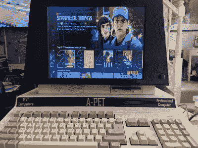

# 2022 年 Hackaday 奖:功能性准将宠物贡品

> 原文：<https://hackaday.com/2022/07/28/hackaday-prize-2022-a-functional-commodore-pet-tribute/>

C64 可能是有史以来最畅销的计算机，但在此之前，Commodore 也制造了几台计算机。[Mjnurney]一直喜欢 Commodore 宠物，并着手制造一些新机器[,采用宠物独特的一体式外形。](https://hackaday.io/project/186514-a-pet-computer)

表壳设计从 Commodore PET 的原始尺寸开始，[mjurney]有三个。然后，它被修改和扩展，为一个合适的键盘腾出空间。该机箱还安装了一个 14 英寸 IPS 显示屏，两个 15W 扬声器和一个气体支柱，使机箱能够打开，便于维护。它实际上也是由真正的金属片制成的！

初级版本内部安装了 Amiga 500，包括其经典键盘。然而，[mjurney]也开发了 PC 版。两者看起来都很棒，看到网飞出现在一台看起来更像 1977 年的家用电脑上真是太棒了。不过，也许最重要的是，我们喜欢屏幕下方的双软驱。

复古表壳向一些我们最喜爱的机器致敬。小小的可能是所有动物中最可爱的。

 [https://www.youtube.com/embed/XEDmjE_5sTI?version=3&rel=1&showsearch=0&showinfo=1&iv_load_policy=1&fs=1&hl=en-US&autohide=2&start=14&wmode=transparent](https://www.youtube.com/embed/XEDmjE_5sTI?version=3&rel=1&showsearch=0&showinfo=1&iv_load_policy=1&fs=1&hl=en-US&autohide=2&start=14&wmode=transparent)

The [HackadayPrize2022](https://prize.supplyframe.com) is Sponsored by: