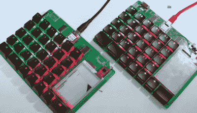

# 开发终极可破解键盘的过山车

> 原文：<https://hackaday.com/2022/08/02/the-rollercoaster-of-developing-the-ultimate-hackable-keyboard/>

当设计笑点中有“可攻击性”的东西时，范围蔓延是这个过程不可或缺的一部分。你最终试图为无限多的用户创造无限多的东西。[扎克·弗里德曼]正带着他的[幻影键盘](https://github.com/ZackFreedman/MiRage)深入兔子洞，并以他一贯的娱乐风格记录进展，包括一些警告性的笔记。

最吸引人的故事来自于在按键下添加 RGB LEDs 的结果，同时当键盘分成两半时，仍然允许一切正常工作。由于在电路板的一侧有一个 IO 扩展芯片，标准的 TRRS 音频电缆足以将两侧连接在一起。但是可寻址发光二极管的增加意味着需要更多的线。

【Zack】认为他已经找到了 SATA 电缆形式的解决方案，但事实证明所有 SATA 电缆都在内部连接第 1、3 和 7 针，使它们对该应用毫无用处。他意识到自己别无选择，只能在键盘的“哑”面添加第二个微控制器，然后通过 TRRS 电缆回到 I2C。然而，基于 RP2040 的 Seeed 肖的绝对拒绝合作。经过两个星期令人沮丧的调试，发现在 pin 定义中有一个错误。幸运的是，这也揭示了肖有一个未记录的辅助接口，他计划将其配置为一个外围设备，使键盘几乎可以通过额外的按键无限扩展。

早期版本的幻影配备了触觉有机发光二极管显示器，但事实证明薄玻璃无法很好地应对反复弯曲，所以不得不废弃。取而代之的是触摸屏电子纸显示器，但现在这似乎正在演变成一个可插入模块，用于任何你想要的输入设备，可能包括一个[触觉智能旋钮](https://hackaday.com/2022/03/13/haptic-smart-knob-does-several-jobs/)。另一项重大更新是支持 CHOC 和 MX 开关的 PCB 尺寸。

这一切都始于[幻影 V1](https://hackaday.com/2021/10/30/a-hackable-keyboard-that-even-has-screens/) 键盘，打算用于【扎克】的[电脑平台](https://hackaday.com/2021/03/25/data-blaster-is-a-hip-rpi-cyberdeck/)的升级版。在意识到有多少人对键盘感兴趣而不是网络平台后，他将注意力转移到了改善幻影上。

这个项目还有一段路要走，所以我们肯定会继续关注它。与此同时，[我们最近介绍了另一款特别定制的键盘](https://hackaday.com/2022/07/28/smart-modular-keyboard-sports-an-e-ink-display-and-a-haptic-feedback-knob/)，它可能会引起你的兴趣。

 [https://www.youtube.com/embed/ZfpNbW_dHbU?version=3&rel=1&showsearch=0&showinfo=1&iv_load_policy=1&fs=1&hl=en-US&autohide=2&wmode=transparent](https://www.youtube.com/embed/ZfpNbW_dHbU?version=3&rel=1&showsearch=0&showinfo=1&iv_load_policy=1&fs=1&hl=en-US&autohide=2&wmode=transparent)

