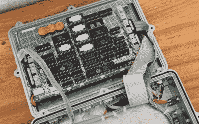

# 珀尔修斯-9，应该是双 6502 便携式机器

> 原文：<https://hackaday.com/2022/07/29/perseus-9-the-dual-6502-portable-machine-that-should-have-been/>

一个问题:在 8 位计算机革命早期的人还记得像这样的双 CPU 6502 便携式机器吗？还是只是双 CPU 的机器？或者仅仅是一台相当便携的电脑？我们不知道，但这引出了一个更深层次的问题:如果[山田光鹤]能用那个时代的零件造出这样一台机器，为什么那时候没有呢？

 我们不确定我们已经有了这个问题的答案，但可能没人想到这一点。或者，如果他们这样做了，将两个昂贵的 CPU 放在一台机器上的想法可能太过分了，不能认真对待。无论如何，自制手机是珀尔修斯生产线上不断增长的制作精美的机器系列中的另一个，所有这些机器都有非常相似的外观和感觉。

对于 PERSEUS-9，[Yamada-san]选择了一个防风雨的铝外壳，它的形状正好适合移动计算机，同时还具有坚固的工业外观。在引擎盖下，有两个华丽的绕线板，其中一个是 48 键键盘和 40×7 字母数字 LED 矩阵显示器的所在地，而另一个是一个密集的艺术作品，包含两个 6502 和许多其他 dip。

该机器由[他的英仙座 8 号计算机](https://hackaday.com/2021/04/21/gorgeous-6502-celebrates-craftsmanship-of-the-early-homebrewers/)、[他的 6802 串行终端](https://hackaday.io/project/176175-6802-serial-terminal)和[他为英仙座 8 号建造的 CI-2 浮点解释器](https://hackaday.io/project/181098-homemade-floating-point-interpreter-for-6502)组合而成。下面是组装这台令人愉快的机器的简短视频。这些产品给我们留下深刻印象的一点是表壳的加工精度，显然全部由手工完成。我们不知道他是如何在没有 CNC 帮助的情况下，设法钻完所有键盘的孔，而没有一个孔稍微错位。

 [https://www.youtube.com/embed/0E3OqTZpx7E?version=3&rel=1&showsearch=0&showinfo=1&iv_load_policy=1&fs=1&hl=en-US&autohide=2&wmode=transparent](https://www.youtube.com/embed/0E3OqTZpx7E?version=3&rel=1&showsearch=0&showinfo=1&iv_load_policy=1&fs=1&hl=en-US&autohide=2&wmode=transparent)

