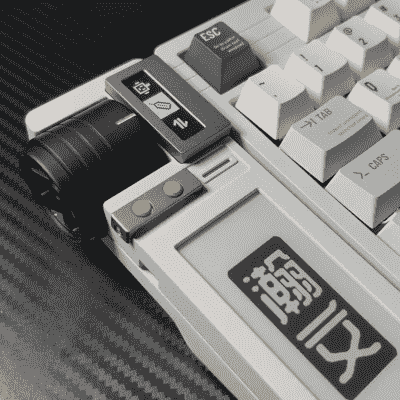

# 智能模块化键盘配有电子墨水显示屏和触觉反馈旋钮

> 原文：<https://hackaday.com/2022/07/28/smart-modular-keyboard-sports-an-e-ink-display-and-a-haptic-feedback-knob/>

虽然大多数人可能认为键盘只是一个带有按键的板，但阅读 Hackaday 的人无疑会知道，有无数种美丽的设计适合任何使用情况。[彭志惠]是最新一款给我们留下深刻印象的产品，[一款出色的定制键盘，包含几个不同寻常的功能](https://www.youtube.com/watch?v=mGShD9ZER1c)(中文视频，带英文字幕，嵌入下方)。开始时只是一个简单的锁定项目，后来变成了[Zhihui]想象中的日常任务的终极键盘。乍一看，它可能只是另一个带有机械开关的定制键盘，但当你看进去时，你会发现它充满了巧妙的设计技巧和简洁的功能。

当他开始设计主键区时，[Zhihui]可以使用任何开源键盘框架。相反，为了获得最高的性能和可配置性，他决定自己做所有的事情。这一直延伸到读出电路:他没有像大多数键盘那样将开关连接成矩阵，而是使用了一组移位寄存器。这使得主臂控制器能够分别读出每个键，消除重影，并允许同时按下任意数量的键。移位寄存器由 4 MHz SPI 时钟驱动，这意味着对所有按键的完整扫描仅需 40 微秒。

 这太棒了，但让这个项目真正有趣的是键盘左侧的一个扩展模块，它可以将它变成[智慧]所说的“智能键盘”。该模块的底部有一个电子墨水显示屏，可以显示各种有用的信息:当前的内存使用情况、电子邮件通知或简单的天气预报。

大电子墨水屏幕旁边是一个小有机发光二极管显示器，它与触觉反馈旋钮协同工作。基于无刷 DC 电机，该旋钮可以以各种方式配置，以执行几种不同的任务。它可以设置为无摩擦旋转模式，这对于快速滚动长文档非常有用。它可以成为一个多级开关来启用或禁用功能，或者是一个带有虚拟终点挡板的音量旋钮。甚至有一个选项可以将它用作物理指标，比如当前的 CPU 使用率。

键盘还装有一个 USB 集线器来连接其他小工具，以及一个锂电池来为触觉旋钮供电，因为它比标准的 USB 2.0 端口所能提供的功率更大。在空格键下方甚至有一个小电容触摸条，允许你用一个拇指在不同的标签之间切换，或者使用快速复制/粘贴功能。

如果这一切听起来像是你对完美键盘的想法，那么你会很高兴听到[Zhihui]计划在清理完他的代码后开源所有的硬件和软件设计。在那之前，你可能想了解一下[触觉智能旋钮](https://hackaday.com/2022/06/24/an-in-depth-look-at-the-haptic-smart-knob/)的工作原理，或者了解一下[用微控制器](https://hackaday.com/2018/09/30/whats-the-cheapest-way-to-scan-lots-of-buttons/)读出一定数量的按钮的最有效方法是什么。

 [https://www.youtube.com/embed/mGShD9ZER1c?version=3&rel=1&showsearch=0&showinfo=1&iv_load_policy=1&fs=1&hl=en-US&autohide=2&wmode=transparent](https://www.youtube.com/embed/mGShD9ZER1c?version=3&rel=1&showsearch=0&showinfo=1&iv_load_policy=1&fs=1&hl=en-US&autohide=2&wmode=transparent)

