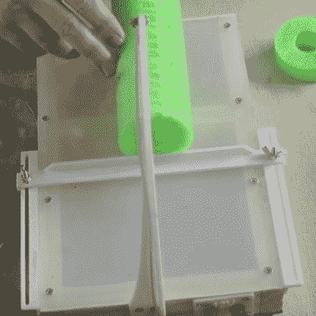

# 泡沫切割器像热刀一样穿过黄油

> 原文：<https://hackaday.com/2022/07/28/foam-cutter-moves-like-a-hot-knife-through-butter/>

用你所有的工具——美工刀、钢锯、锯齿塑料刀——做足够多的尝试来切割泡沫，你会希望切割得更干净、更快、更好。虽然有各种各样的方法来制作热线泡沫切割器，但来自[jasonwinfieldnz]的这个设计既有趣又可以模仿。

 如果你还不知道，镍铬合金丝是一种很棒的东西，在旧货店的吹风机和烤面包机里都能买到。它受热时伸展，冷却时收缩。

这个建筑有趣的地方在于，jasonwinfieldnz 没有使用弹簧来保持镍铬合金线的张力，而是设计并 3D 打印了一个 PLA 弓，优雅地完成了这项工作。虽然[jason]最初担心弓可能会融化，但他在实践中发现，虽然弓摸起来会变热，但还没有热到足以弯曲。

一个很好的接触是简单的围栏，沿着两个插槽骑行，并用蝶形螺母固定。我们还喜欢[jason]主要用废料制作这个泡沫切割器，他没有买一卷镍铬合金，而是选择了一个细长的加热元件并掠夺了电线。

如果你是个 nichrome noob，要知道做这项工作并不需要太多精力。尽管[jason]身边有一个计算机电源，但这完全是多余的，所以你肯定会想限制电流。休息之后，请观看构建视频。

对你来说还是不够便携？你真正需要的是一个 18650，一些镍铬合金，和一些小零件来把它们固定在一起。

 [https://www.youtube.com/embed/Q5-bY5e8Mso?version=3&rel=1&showsearch=0&showinfo=1&iv_load_policy=1&fs=1&hl=en-US&autohide=2&wmode=transparent](https://www.youtube.com/embed/Q5-bY5e8Mso?version=3&rel=1&showsearch=0&showinfo=1&iv_load_policy=1&fs=1&hl=en-US&autohide=2&wmode=transparent)

