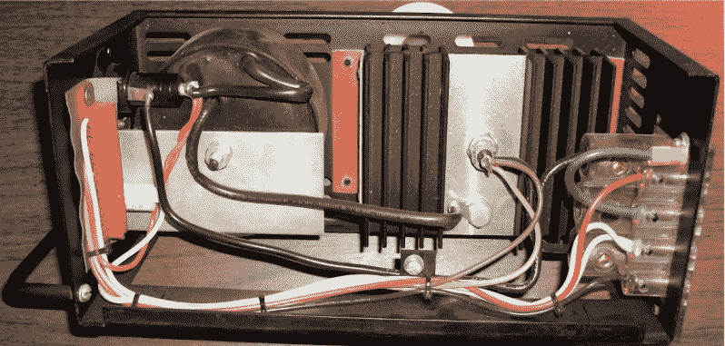
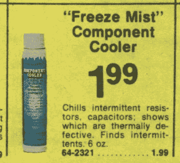

# 问 Hackaday:你的第一个电子产品胜利是什么？

> 原文：<https://hackaday.com/2022/08/01/ask-hackaday-what-was-your-first-electronics-win/>

回到高中，我加入了舞台工作人员——因为我当然加入了。就学生戏剧团体而言，它相当活跃，每年有两个节目要制作，总是有很多工作要做。我被灯光组吸引住了，这对我很合适。除了电气部分的工作外，还有很多在脚手架和摇摇晃晃的梯子上吊灯的工作，这对年轻人和不朽者来说是很大的乐趣。此外，演出期间还有灯光控制台，这是我最后两年接手的工作。

不幸的是，照明系统有点可怜。控制台安装在舞台的右侧，而不是明智的人会把它放在房子的前面。尽管只有大约 10 岁，调光器已经开始失效。电路板上大约有 20 个频道，但你总是可以指望其中一个频道出现故障，有时在演出期间，需要一些英雄来将灯光重新接入我们一直作为备用的调光器之一，只是为了这个目的。

## 危险正在发生

我已经厌倦了这种糟糕的状况，随着控制台上贴满胶带的调光器控制器的数量开始超过好的控制器，我决定看看我能做些什么。当然，控制台只是真正的调光器的前端，在 DMX 之前的日子里，它只是在 0 V 到 10 V 的信号下工作，并通过 SCR 控制连接到它的灯。调光器组件本身被安装在舞台附近房间内墙上的一个架子上，我们创造性地称之为“调光室”调光架安装在墙上，所以你必须站在桌子或梯子上才能够到。非常粗略。

现在，请记住这是 20 世纪 70 年代末，时代不同了。那时我们十几岁的孩子更自由，我们做的事情可能会让一些人在这些天被逮捕。这包括愉快地将沉重的钢制外壳从调光器组的架子上取下，每个调光器组都有裸露的导线承载线路电流，同时在梯子顶上保持平衡。独自做这件事，没有得到允许，只有最微弱的一点点知道我在做什么。不过，还是那句话——不朽。

Like this, but deadlier. A Kliegl Bros P-73 SCR dimmer, with control board removed. This is a later version of the one I fixed, with fewer high school student killing features. Source: [Kliegl Bros. Collectors Society](https://klieglbros.com/service/dimmers/P73/Kliegl%20Bros%20P73%20Dimmer%20Manual%20release%201_0.pdf)

在某种程度上躲过了打开调光器后，我开始做真正危险的部分——在一架活动的调光器组件中诊断问题。每个调光器都有一个大而粗的环形变压器，一个垂直安装的 PCB，一个带巨大螺柱安装 SCR 的大散热器，所有这些都安装在一片拧入机架的玻璃纤维通道上。调光器被紧紧地装在机架中，它们之间没有太多的空间，所以很难接触到 PCB 上的元件来测试电压。更不用说危险了——一个错误的举动，你可能会碰到一个散热片，所有这些散热片都连接到线电压。

## 冷静下来

幸运的是，我不需要接触任何东西来诊断问题。我正在研究的调光器有一个明显的热间歇性——它只会在使用半小时左右后开始出现问题。我已经让调光器预热并熄灭，带着我从 Radio Shack 买的可靠的元件冷却器罐，从我的梯子顶上，我开始用大量消耗臭氧层的氟利昂快速处理不稳定的调光器 PCB 上的元件。就像我说的，不同的时间。

Ozone? That’s a problem for future Dan. Freon component cooler, from the 1978 Radio Shack Catalog. Source: [RadioShackCatalogs.com](https://radioshackcatalogs.com/flipbook/1978_radioshack_catalog.html)

当时，我只听说过寻找间歇热，这要感谢电台的目录。我真的没有想到这个小技巧会奏效，所以想象一下当我破坏 PCB 上的一个特定晶体管并听到灯重新亮起的明确无误的声音时，我有多惊讶——毫无疑问，是那个大环形变压器。我不敢相信我找到了问题所在！我看着冷冻晶体管上的氟利昂诱导霜变成水并最终蒸发，这时调光器再次熄灭。我对自己的发现欣喜若狂，我不停地让那个可怜的晶体管起死回生，看着它死去，只是为了它的新奇感。我自己发现了问题。

满怀自豪，我把有缺陷的调光器从架子上拿了出来——这本身就是一项危险的工作——拆开了可疑的晶体管，把它拿到了当地的电子商店。不，不是 Radio Shack-Hatry Electronics，它是当地电视维修店和该地区少数几家电子制造商的供应商。这是一家真正的电子商店，柜台后面是一排排零件。我把我快不行了的晶体管给了店员，他给了我他那巨大的枯树对照表中列出的最近的火柴，那天下午晚些时候，那个调光器终于不再给我们带来麻烦了。

前几天在想这个维修，突然想到这是我第一次，不合格的“打赢”电子维修。从那时起，我只摆弄了五年左右的电子产品，但在那之前，我的大多数修理尝试都以失败告终。我设法修好了同学们让我检查的几台卡式录音机，但前提是传动皮带坏了或插孔上的焊点坏了。至少对我来说，这种修调光器在当时是下一个级别的东西。我已经意识到了问题所在，正确地识别出了有缺陷的部件，并进行了修复。全靠我自己，不用自杀。

我意识到，总的来说，这只是一次简单的修理。但这对十几岁的我来说是一件大事，从很多方面来说，这是我接下来一切的开始。能够进行修复让我相信我可以做到这一点，并让我走上了修理东西的道路。当然，不仅仅是电子产品——现在修理任何东西都让我有机会获得 40 多年前那一天的感觉，在一个摇晃的梯子上保持平衡，用一罐氟利昂让灯忽明忽暗。我从未找回那种感觉，但我一直在追寻。

## 轮到你了

你呢？你在电子学方面的第一次胜利是什么？这是像我一样的史诗般的修复吗？或者可能更像是最终让电路工作的路线——毕竟，第一个闪光灯项目可能是一个真正的匆忙。无论是什么让你踏上了这条旅程，让你读到了(希望你喜欢)一个关于几年后可能报废的东西的维修故事，请告诉我们。我们都以某种方式走到了这一步，有趣的是发现其他人走了什么路，是什么让他们转到了“我能行！”位置。