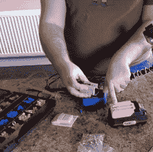

# 幼儿曾得到大男孩电池升级

> 原文：<https://hackaday.com/2022/07/29/toddler-ev-gets-big-boy-battery-upgrade/>

不管我们开什么类型的车，都有电池。这些电池会随着时间的推移而损耗。即使是高端电动汽车的电池寿命也是有限的。但是，当你的电动车使用铅酸电池时，电池寿命的测量范围要短得多。尤其是当电动车由一个比填充老虎玩具还占不了多少空间的司机驾驶的时候！谢天谢地，这个小女孩有一个机械师:

A 3d printed adapter sends go-juice to the DC-DC converter

她的父亲[Brian Lough]在视频中记录了他女儿的玩具卡车从铅酸到锂离子电池的迅速转变，你可以在休息时看到这个视频。

面对类似于真正适合道路行驶的客车的挑战，[Brian]与[[bitluni](https://www.youtube.com/channel/UCp_5PO66faM4dBFbFFBdPSQ)]合作解决这些问题。12 V SLA 电池被一个电动工具的 20 V 锂离子电池组所取代。一个 3d 打印适配器被用来断开包装上的电源引脚。过高的电压由一个直流-DC 转换器处理，经过一点调整后，输出稳定的 12 V 电压

我们喜欢黑客的地方在于，它是任何人都可以做的事情，它暗示了什么类型的工程会进入更大的项目。一定要把视频看完，看看那些可爱又咯咯笑的结果！

说到更大的项目，看看我们在 2016 年报道的这个[铅酸到锂离子转换所需的逆向工程。](https://hackaday.com/2016/06/16/reverse-engineering-a-nissan-leaf-battery-pack/)

 [https://www.youtube.com/embed/N70SnySE2Mw?version=3&rel=1&showsearch=0&showinfo=1&iv_load_policy=1&fs=1&hl=en-US&autohide=2&wmode=transparent](https://www.youtube.com/embed/N70SnySE2Mw?version=3&rel=1&showsearch=0&showinfo=1&iv_load_policy=1&fs=1&hl=en-US&autohide=2&wmode=transparent)

