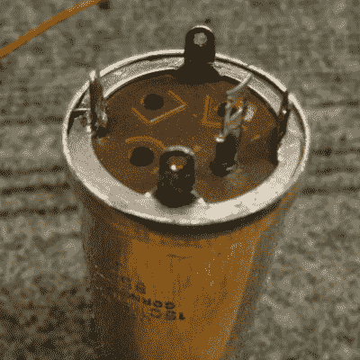

# 修复旧的电容，但保持“电容”的外观

> 原文：<https://hackaday.com/2022/07/30/fix-old-caps-but-keep-that-can-capacitor-look/>

老式电子产品和电容器的替换往往是齐头并进的。为什么？因为电解电容器就是不能持续*时间*，反正不是大多数其他元件的方式。

The metal terminal ring and the central plate are kept for re-use, and the metal case re-crimped after the internals of the capacitor are replaced with a modern equivalent.

用现代的替换物替换旧的盖子是一回事，但是如果电子元件没有被隐藏起来，并且是设备外观的重要组成部分呢？[lens42]分享了一种替换古董罐式电容器的方法，让它们看起来完全是原装的。所需要的只是一些技巧的小心应用。

首先要做的是小心地锉掉金属罐的卷边，直到可以松开固定端子的环和板。一旦关闭，内部构件可以从金属罐中取出进行处理。因为旧盖子的内部不会被重复使用，[lens42]建议简单地钻一个洞，拧上一个方头螺栓作为把手，然后把所有东西都拔出来。现在旧罐中有足够的空间来容纳电容器的现代替代品，人们甚至可以重复使用原来的端子。

剩下的工作就是将旧罐重新卷曲在端子环周围，以恢复工厂制造的外观。为了最好地做到这一点，[lens42]创造了一个锥形的衣领。轻轻敲打罐子，迫使底部变成锥形，开口逐渐卷曲在端子环周围。也可以小心翼翼地直接锤击法兰，但光洁度不会那么好。这种新的压接工作可能看起来与以前不完全一样，但一旦盖子被重新安装到原始设备上，就不可能知道它已经以任何方式进行了修改。

如果这听起来有点吓人，不要担心。[lens42]提供大量图片。如果这种事情符合你的胃口，你可能会想看看 [Caps Wiki](https://hackaday.com/2022/02/24/caps-wiki-place-for-you-to-share-your-repair-notes/) ，这是一个集中和分享技术维修细节的努力，尤其是对老式电子产品而言。