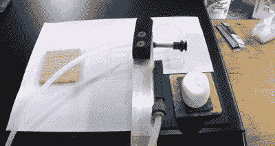

# 工业机器人被重新用于制作 S'Mores

> 原文：<https://hackaday.com/2022/07/31/industrial-robot-repurposed-to-make-smores/>

北半球现在是夏天，这意味着可以生起篝火来煮热狗、驱赶蚊子，当然，还可以做更多的点心。对于我们远方的朋友来说，这是一个火烤棉花糖和两块全麦饼干夹着一块巧克力。这么叫是因为当你做完后，你会想要更多。这个食谱很简单，任何孩子都能告诉你怎么做。但如果你不是孩子呢？如果你因为是工业机器人而连手*、*都没有呢？这是【过度杀戮】在[休息](https://www.youtube.com/watch?v=ic1t25s-9RM)下面的视频中接受的挑战。

 从一台 1997 年制造的发那科 S-420 i W 工业机器人开始，【过度矫枉过正】煞费苦心地教自己的私人机器人如何制作 S'Mores。用气压缸来打开微波炉是一种不错的做法，S'More-bot 商业端的真空夹持器也是如此。

我们知道，我们说过你应该在营火上制作它们——但是谁会为了融化一些巧克力而冒险烹饪他们的老式机械臂呢？

这个黑客背后有很多故事，在他们的另一个视频中,【过度杀戮】解释了他们如何获得、运输和三相驱动一个过时的工业机器人。当然，这是 Hackaday，所以这是一个之前在工业机器人的[逆向工程中出现过的主题，我们之前报道过。](https://hackaday.com/2020/04/08/industrial-robot-given-new-life-and-controller/)

 [https://www.youtube.com/embed/ic1t25s-9RM?version=3&rel=1&showsearch=0&showinfo=1&iv_load_policy=1&fs=1&hl=en-US&autohide=2&wmode=transparent](https://www.youtube.com/embed/ic1t25s-9RM?version=3&rel=1&showsearch=0&showinfo=1&iv_load_policy=1&fs=1&hl=en-US&autohide=2&wmode=transparent)

感谢[Phil]的精彩提示！