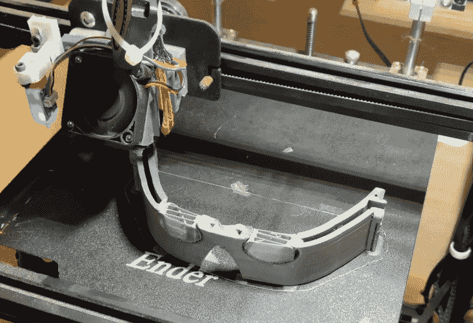

# 酷酷的口罩变成了过度设计的头痛

> 原文：<https://hackaday.com/2022/07/31/cool-face-mask-turns-into-over-engineered-headache/>

看到他的妻子试图用一个凉爽的面罩来度过偏头痛的痛苦，【火花和代码】开始思考改善这种情况的方法。将她从这些令人虚弱的疼痛中解救出来的愿望驱使他制作了一个主动冷却的面具，同时制造了他自己的过度设计的混乱的头痛。

Void spaces inside the printed mask are filled with chilled water.

[Sparks and Code]想做一个可以循环冷却水的面罩，而不是将面罩放入冰箱冷却。有了一个足够大的充满冰的储水池，他认为这种面具应该能够在一个舒适的温度下保持几个小时，减少去冰箱的需要。

[火花和代码]开始使用摄影测量学获得他妻子面部的 3D 模型。缺乏兼容的计算机和支持 CUDA 的 GPU 意味着使用谷歌云来完成繁重的工作。当他们开始制作面罩时，事情变得复杂了。然后出现了不必要的电子设备。然后是过于复杂和完全不必要的仪器。遗传算法？是的。那些也是。

我们不会破坏结局——但可以说，[火花和代码]学到了一个冷酷的教训:越简单越好！话又说回来，有时过于复杂也是一个要点，比如在[这个太复杂的口香糖贩卖机](https://hackaday.com/2016/11/25/mintomat-an-overcomplicated-gumball-machine/)中。

 [https://www.youtube.com/embed/Hj53NaAmZP0?version=3&rel=1&showsearch=0&showinfo=1&iv_load_policy=1&fs=1&hl=en-US&autohide=2&wmode=transparent](https://www.youtube.com/embed/Hj53NaAmZP0?version=3&rel=1&showsearch=0&showinfo=1&iv_load_policy=1&fs=1&hl=en-US&autohide=2&wmode=transparent)

