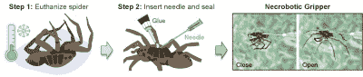

# 死蜘蛛变成了机器人抓手:这是死亡机器人！

> 原文：<https://hackaday.com/2022/08/01/dead-spider-becomes-robot-gripper-its-necrobotics/>

机器人手臂和抓取器每天每小时都在做重要的工作。它们被用于世界各地的生产线，几乎不停地在指定的维护窗口之外辛勤工作。

它们通常由钢铁制成，由强大的液压系统提供动力。然而，一些科学家已经采用了一种更小规模的方法，这可能会让神经质的人感到恐惧。他们已经想出如何将一只死蜘蛛变成一个有用的机器人抓手。

这个新弗兰肯斯坦领域的名字？为什么，这是僵尸学，当然！

## 与自然一起工作

 [https://www.youtube.com/embed/1JOS6hMHIUM?version=3&rel=1&showsearch=0&showinfo=1&iv_load_policy=1&fs=1&hl=en-US&autohide=2&wmode=transparent](https://www.youtube.com/embed/1JOS6hMHIUM?version=3&rel=1&showsearch=0&showinfo=1&iv_load_policy=1&fs=1&hl=en-US&autohide=2&wmode=transparent)

科学家和工程师长期以来一直对自然界的成就怀有崇敬之情。微小昆虫的能力远远超过我们最大的机器人，可以独立工作几天或几周，甚至不需要插上电源。蜘蛛和甲虫复杂的机械系统甚至超越了我们迄今为止最好的工程技术。

蜘蛛尤其令人印象深刻。它们有八条惊人力量的腿，特别是考虑到它们的重量和力量需求。莱斯大学的一组研究人员决定直接黑掉蜘蛛本身，而不是试图从头开始创造出与这些能力相匹配的东西。

The process of making necrobiotic grippers with wolf spider carcasses. Credit: [Preston Innovation Laboratory, Rice University](https://news.rice.edu/news/2022/rice-engineers-get-grip-necrobotic-spiders)

蜘蛛腿只有收缩的肌肉，而伸展是通过液压机构实现的。在蜘蛛的体内，一个充满血液的腔室膨胀和收缩，以控制生物的腿的运动。每条腿都有一个阀门，允许支架单独控制它们的运动。死后，所有这些阀门都打开，蜘蛛的液压系统失去压力。这就是蜘蛛死后腿会蜷曲的原因。

研究人员意识到，他们可以利用这个液压系统来随意伸展和收缩蜘蛛的腿。在死卡盘的情况下，所有单个腿阀通常会失效打开，因此控制仅限于同时伸展或收缩所有腿。这使得死蜘蛛的行为像一个机器人抓手，就像你可能在技能测试机街机上看到的一样。

研究人员对狼蛛进行了研究，并开始在低温下对它们实施安乐死。然后将一根针插入蜘蛛体内，并用胶水封住。这使得三脚架内部的液压通道可以用空气加压，以伸展支腿。释放压力让双腿再次收缩成蜷缩的姿势。

## 测试和应用

死蜘蛛惊人的强壮。在测试中，该小组能够从单个蜘蛛尸体中获得超过 1000 次开合循环。在这个范围的高端，一些磨损是显而易见的，研究小组认为这主要是由于蜘蛛身体的脱水。关于这个问题能否通过特殊的聚合物涂层来防止尸体变干的研究正在进行中。

提升力也令人印象深刻。狼蛛的身体能够可靠地举起自身体重的 130%。有些机构也会大大超过这个数字。当然，将动物尸体用作工程材料时，可变性是可以预料的。

研究小组认为，死蜘蛛可以作为小规模取放任务的有效驱动器。该团队的演示包括使用蜘蛛抓爪将跳线从电子线路板中拉出。其他例子包括移动小物体，甚至举起另一只蜘蛛。坏死机器人手爪的好处是蜘蛛的八条腿擅长抓取形状和大小奇怪的物体。

该小组还列举了坏死性手爪的可再生性。莱斯大学机械工程助理教授丹尼尔·普雷斯顿说:“蜘蛛本身是可生物降解的。“我们不会引入大量的废物流，这对于更传统的组件来说是个问题，”他补充道。

然而，所示的坏死性夹钳确实有一些限制。1，000 次循环的可用使用寿命对于机器人夹持器来说相对较低，尤其是在大规模生产环境中使用的机器人夹持器。死蜘蛛的身体也有很多可变性，这是常规工程机器人组件所看不到的。此外，虽然蜘蛛尸体本身是可生物降解的，但针、胶水和塑料配件却不是。另外，蜘蛛抓爪的生产是一项费时费力的工作。然后是蜘蛛饲养设施所需的大量投资。

## 死亡机器人学的未来

这项研究引人注目，展示了对死后稳定蜘蛛尸体的可靠控制。这也比其他使用插入蟑螂大脑的电极进行控制的昆虫机器人项目简单得多。没有必要操纵一个生物的大脑，或者对抗它的自然本能来让它完成一个给定的任务。

然而，这项研究可能会引发一些伦理问题。或许，这比电子奴役生物要少一些麻烦。不管怎样，人类一直对正确对待和尊重人类遗体有着强烈的感情。例如，与用老鼠或仓鼠进行同样的研究相比，使用蜘蛛可能会招致更少的谴责。对一只猫或一只狗做同样的尝试，你可能会认为你的实验室会以惊人的速度关闭。

澄清一下，我们不认为你会很快使用基于蜘蛛的取放工具。但是在尸解学领域的工作可能会教会我们很多关于动物和昆虫的身体是如何工作的。它们还可能指导我们自己的机器人或生物机电产品的开发。在任何情况下，对知识的追求经常给我们呈现出奇怪而曲折的道路。有时候，只是有时候…那些小路会被蜘蛛覆盖。