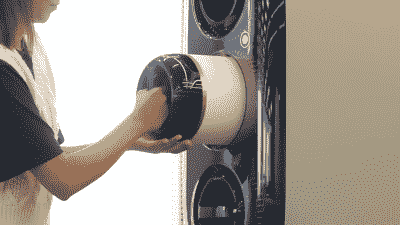

# 丰田的燃料盒有助于氢的便携化

> 原文：<https://hackaday.com/2022/08/02/toyotas-cartridge-helps-make-hydrogen-portable/>

氢一直被吹捧为清洁道路交通的解决方案。当用于燃料电池时，使用它的唯一排放物是水，它消除了电池电动汽车充电缓慢的问题。它也被认为是从天然气供应到笔记本电脑电池的替代品。

丰田一直在努力推进氢技术，并致力于为此开发车辆和基础设施。该公司最新的努力包括一个可携带的氢气盒——[让你在旅途中携带氢气！](https://www.engadget.com/toyotas-prototype-cartridge-is-a-way-to-make-hydrogen-portable-120024714.html?guccounter=1)

## 解决储存和运输问题

The portable hydrogen canisters weigh just 5kg. Credit: Toyota

尽管氢有很多好处，但处理起来有点棘手。H2 分子非常小，以至于它们往往会从大多数容器中泄漏出来，找到在其他分子之间滑动的方法。这可能会导致问题，如泄漏或金属部件的氢脆。因此，必须仔细选择材料来安全地储存氢。它通常以压缩气体或液体的形式储存，或者以特殊的金属形式储存在固体中。

丰田吸引人的圆形罐的尺寸非常紧凑——400 毫米长，180 毫米直径。丰田的脚注表明他们依靠“高压氢气罐”，暗示以气体形式储存。罐子的目标重量是 5 公斤。因此，这些罐可以由一个人容易地操作和携带，作为一个轻量级的能量存储器。它们比一箱典型的丙烷(约 30 公斤)或一整罐汽油(约 25 公斤)要轻得多。

 [https://www.youtube.com/embed/poYJCJR-WRo?version=3&rel=1&showsearch=0&showinfo=1&iv_load_policy=1&fs=1&hl=en-US&autohide=2&wmode=transparent](https://www.youtube.com/embed/poYJCJR-WRo?version=3&rel=1&showsearch=0&showinfo=1&iv_load_policy=1&fs=1&hl=en-US&autohide=2&wmode=transparent)

丰田用一个奇怪的指标讨论了碳罐的功率输出。一个盒子应该产生“足够一个典型的家用微波炉工作大约 3-4 个小时的电力”鉴于微波炉通常一次运行几分钟，人们怀疑丰田总部的电视晚餐可能有点疲惫。无论如何，[新闻稿](https://global.toyota/en/newsroom/corporate/37405994.html)指出，这是从 3.3 千瓦时的典型容量得出的，当时碳罐与“典型的燃料电池”系统一起使用

虽然功率不大，但总容量约为 660 瓦时/千克。即使考虑到花哨的塑料外壳，它仍然比锂离子电池好，锂离子电池的最佳功率约为 260 瓦时/千克。

Toyota demonstrated a twist-and-lock insertion method for the hydrogen canisters which feels very futuristic indeed.
Even better is if the machine sucks them in automatically like those magic Macintosh disk drives of the 1980s. Credit: Toyota, Woven City

在如此低的总容量下，很难想象这些罐被用于运输应用。大多数电动汽车的电池容量超过 70 千瓦时；需要超过 18 个这样的滤毒罐才能提供相同的能量。3.3 千瓦时可以让你的电动滑板车行驶相当长的时间，但你需要有一个燃料电池和一个 5 公斤的罐子挂在上面。

相反，看起来丰田把这种滤毒罐视为一种比使用电池更节省重量的方式来提供清洁电力。这些滤毒罐将在丰田的编织城市进行测试，这是日本一个未来的“智能城市”，希望试验新技术。在那里，它们将被用于运行“家庭内外广泛的日常生活应用程序”潜在的应用可能是在户外野餐时加热盘子，或者为没有内燃机发电机噪音的露营地提供照明。

The cartridges take a difficult and fussy fuel and put it into a no-mess, no-fuss format. Credit: Toyota

总的想法是，罐是一种以便携式形式输送氢能源的简单方式。与液体燃料不同，氢不容易从一个容器倒入另一个容器。取而代之的是，给一堆罐子充电可以很容易地将氢气运送到需要的地方。

丰田对氢作为未来燃料寄予厚望。它在氢燃料汽车上投资巨大，但在电池电动汽车方面仍然落后于竞争对手。有了这些氢罐，丰田“设想氢进化成一种熟悉的、广泛使用的能源形式。”

从今天来看很难看到丰田的远见。电动汽车比以往任何时候都更好，氢的生产通常比你想象的需要更多的化石燃料。然而，这项技术发展迅速，从丰田的便携式燃料罐到[氢糊](https://hackaday.com/2021/02/06/the-future-of-hydrogen-power-is-paste/)和[高级铝燃料罐](https://hackaday.com/2020/05/26/aluminium-pucks-fuel-hydrogen-trucks/)。这些措施是否能阻止更广泛的纯电动化，还有待观察。