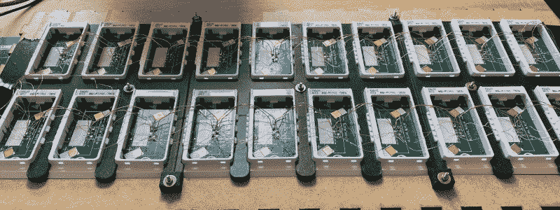

# 解放后的 E-Ink 货架标签变成了 10×2 显示屏

> 原文：<https://hackaday.com/2022/08/04/liberated-e-ink-shelf-labels-turned-10x2-display/>

制作一个使用电子墨水技术的面板有多贵？这可能取决于你有多灵活。[RBarron]我读到了逆向工程销售点货架标签，并在易贝找到了它们，每张仅售一美元多一点。接下来，他们 20 个人[在一个小组](https://rbaron.net/blog/2022/07/29/Daisy-chaining-multiple-electronic-shelf-labels.html)中一起工作。

面板通常使用射频或 NFC 编程，但也可以使用 BLE。当然，您可以依次处理每一个问题，但这不是很有效。这里的方法是使用一个标签作为 BLE 控制器，然后驱动串行菊花链中的其他显示器，其中每个标签的接收引脚设置为前一个标签的发送引脚。

这允许一段简单的代码读取传入的消息，并处理寻址到该标签的消息。其他任何东西都会从串行端口发送出去。只有 BLE 节点有特殊的固件。起初，我们认为每个标签都需要一个地址，我们想知道除了每个标签都有唯一的固件之外，如何设置它，因为似乎没有一种方便的方法来进行基于硬件的配置。

实际的解决方案很巧妙。每个消息都有一个跳数计数器，每个节点在沿着链传递消息之前都会递减该计数器。当跃点计数为零时，消息就到达了目的地。简单且非常容易配置。理论上，你可以用任何其他标签替换第一个标签之后的任何标签，系统仍然可以正常工作。

甚至布线也很巧妙，用夹具来弯曲电线，以确保面板上每个元件的间距均匀。一个激光切割的盒子完美地完成了这个项目。代码都可以在 [GitHub](https://github.com/rbaron/elink) 上找到。我们已经看到这种标签被用于像[气象站](https://hackaday.com/2020/11/27/repurposing-large-electronic-price-tags/)这样的事情。更不用说[会议徽章](https://hackaday.com/2019/02/25/e-ink-price-tags-fall-off-store-shelves-onto-your-workbench/)。