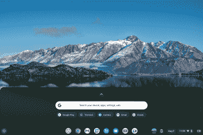
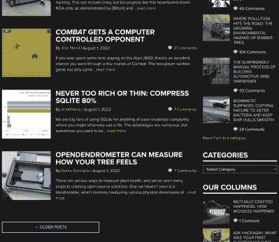

# Linux Fu:chromeos Flex 虚拟化

> 原文：<https://hackaday.com/2022/08/10/linux-fu-the-chrome-os-flex-virtualization/>

The Flex Desktop is user-friendly and responsive

你可能听说过谷歌 Chromebooks。与 Android 一样，Chrome OS 基于 Linux 的一些变体，但它的目标是“云优先”策略，因此 Chromebooks 通常没有大量的存储或计算能力。如果你有一个真正的 Chromebook，你也可以通过虚拟化使用它来运行某些其他类型的程序。然而，谷歌最近推出了 Chrome OS Flex，它可以安装在你可能碰巧随身携带的备用笔记本电脑上。把那台唯一的 Windows 7 笔记本电脑改装成运行 Chrome 操作系统似乎很有吸引力，尤其是如果你能在上面运行 Linux 应用的话。不幸的是，Chrome OS Flex 有一个非常不同的用例，我只建议如果你符合它解决的确切用例，就安装它。

当然，另一个选择是在旧硬件上安装 Linux。有几个发行版就是为了这个目的而开发的，老实说，甚至大多数主要发行版都可以在旧的硬件上很好地工作，只需要稍微调整一下，关闭一些更耗费资源的特性。这假设您知道如何安装、调整和维护 Linux。

## 这就是它的用途

事实上，这就是 Chrome OS Flex 的确切用例。如果你想把你的旧笔记本电脑给爷爷，在上面安装 Linux 可能会很有挑战性，除非爷爷非常精通技术。即使是对 Windows 或 Mac 相当熟悉的人也会发现 Linux 的选项、日志文件和命令行数量之多令人望而生畏。有些发行版比其他的好，但是最后，如果你有一天过得很糟糕，你真的需要了解这个系统或者愿意学习它。

Chrome OS 故意不给你太多选择。这种安装很容易，但是不灵活。你必须在一台正常工作的计算机上创建一个 USB 驱动器，而安装程序没有给你任何选项，比如说，作为辅助操作系统安装。你可以从 USB 启动，或者在实时模式下尝试操作系统，或者安装它，清空你的硬盘。就是这样。

如果你想做的只是网上冲浪和使用基于 Chrome 的应用程序，那太好了！该系统运行良好，非常快捷。但是运行其他系统的应用程序呢？与真正的 Chrome 操作系统不同，你不能运行 Android 应用或其他任何东西。你也许可以运行 Linux 应用程序，但是有一些问题。

## 现实世界

我把操作系统安装在一台旧的惠普 X2 三合一敞篷车上，我碰巧已经退休了。我承认这很容易，性能也很好——比我在旧硬件上强行安装的 Windows 11 好得多。但是我很失望地发现在开发者模式中没有启用 Linux 子系统的选项。硬件不在批准名单上，所以你不得不接受前置摄像头无法工作。此外，这款别致的背部摄像头也有一些问题，尽管它通常是可行的。

Vivaldi running on Flex in Linux mode

原因？笔记本电脑的 BIOS 中关闭了虚拟化。一旦你打开它，选项就会出现，你可以安装一个基本的基于 Debian 的 Linux 操作系统。但是，它不能在 ChromeOS Linux 实例上运行。它是虚拟的。这意味着您有自己的根文件系统，它不同于“真正的”文件系统。尝试使用基于 Linux 的软件还有一些其他问题。例如，一些设备——尤其是摄像头——无法从 Linux 内部访问。所以你不能用 Linux 浏览器进行视频会议——至少不做调整是不行的；也许有办法让它工作。

例如，安装 Snap 需要添加`squashfs`，这不会自动发生。有些安装的软件就是不工作。Vivaldi 是 Chrome 的替代品，它确实有用，但由于它不在主要空间，所以它不能取代 Chrome。

## 没有安卓？

安卓应用呢？像 AnBox 这样的东西能让你在 Flex 上运行 Android 应用吗？也许吧，但是它不容易安装，因为你需要内核模块的支持。因此，虽然你可以在 Chrome OS Flex 上运行 Linux，但它需要大量的调整和修改，而且仍然不支持所有东西。既然如此，为什么不直接加载 Linux 呢？

除了安装、使用和维护的简单体验之外，Chrome OS Flex 确实没有什么是 Linux 做不到的，至少做得一样好，甚至可能更好。但是一旦你试图安装 Linux 软件，你又回到了破解丢失的软件包和读取错误日志的状态。何必呢？

## 只是我吗？

但如果你不在乎运行 Android 或 Linux 应用程序，这是一个让旧笔记本电脑重新成为网络设备的好方法。只是不要期望它是您的日常 Linux 驱动器。在我体验之后，我注意到了下面的 YouTube 视频，名为“Chrome OS Flex 是一场噩梦。”我不知道我是否会走那么远，但他的经历反映了我的经历，你可能想看看它如何处理其他一些笔记本电脑、Steam 和其他一些应用程序。你不能击败价格，对于正确的使用案例，它可能只是门票。对于其他人来说，安装 Linux 就可以了。

你会尝试 Flex 吗？如果不是，是什么让你想到它？安卓仿真？Windows 仿真？访问底层 Linux 系统？

 [https://www.youtube.com/embed/oTOoqjycn2Q?version=3&rel=1&showsearch=0&showinfo=1&iv_load_policy=1&fs=1&hl=en-US&autohide=2&wmode=transparent](https://www.youtube.com/embed/oTOoqjycn2Q?version=3&rel=1&showsearch=0&showinfo=1&iv_load_policy=1&fs=1&hl=en-US&autohide=2&wmode=transparent)

