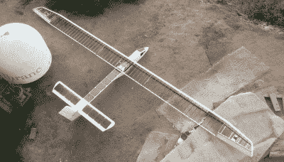

# 太阳能飞机也许能持续一整夜

> 原文：<https://hackaday.com/2022/08/06/solar-plane-might-be-able-to-last-through-the-night/>

“只需在机翼上增加太阳能电池板”是一个提高固定翼无人机飞行时间的流行建议。然而，现实并非如此简单，增加的重量和复杂性很容易伤害而不是帮助飞行时间。[Bearospace Industries]的团队一直在努力应对这一挑战，他们的[*太阳能龙*](http://www.bearospaceindustries.com/advanced-projects.html)飞机最近进行了非常成功的[试飞](https://www.youtube.com/watch?v=JQJ5c7zJ_yo)，产生的功率比消耗的功率多了大约 50%。

理想的机身设计应该是从底层开始，平衡一系列因素，而不是试图在现有的飞机上安装太阳能电池板。这些因素包括重量、效率、飞行包线、结构完整性和太阳能电池板的最大表面积。所有的考虑因素都由[Bearospace]在一个出色的深度[视频](https://www.youtube.com/watch?v=7ltzgJIuQSs)中进行了讨论，这是任何计划建造太阳能飞机的人不可或缺的资源。

【Bearospace】在*太阳龙*上把所有的理论付诸实践，它在机翼、尾翼和三角形机身上集成了超过 250 W 的高效 Maxeon C60 太阳能电池。电池的连线使其最大功率点电压尽可能接近飞机的 3S 锂离子电池组，使太阳能电池能够直接为电池充电。为了防止过度充电，根据需要，使用固态继电器将太阳能电池与蓄电池断开。

即使电池板只在 65%的时间里处于连接状态，电池在上午晚一个小时的飞行中保持相同的平均充电状态。该团队预计，如果有一个好的 MPPT 充电器，他们可能会从电池中获得更好的性能，这在不太理想的太阳能条件下是必需的。

太阳能龙的有效载荷容量比试飞中使用的大得多，对于 MPPT 充电器和大得多的电池来说绰绰有余。有了这一点和一长串其他计划中的改进，太阳龙可能会在白天充电，并在夜间仅靠电池供电飞行。提到的一个有趣的潜在方法是在白天以高度的形式储存能量，并利用飞机的缓慢下沉率来最小化夜间的电池使用。

太阳能飞机每隔几个月就会在黑客日出现，而[【rctestflight】是最常见的嫌疑人之一](https://hackaday.com/2019/10/09/soaring-with-the-sun-4-years-of-solar-rc-planes/)。长时间飞行也不需要太阳能电池板，就像[【马修·海斯凯尔】只用电池供电飞行 10 小时 45 分钟](https://hackaday.com/2021/06/27/electric-rc-plane-flies-for-almost-11-hours/)所证明的那样。

 [https://www.youtube.com/embed/JQJ5c7zJ_yo?version=3&rel=1&showsearch=0&showinfo=1&iv_load_policy=1&fs=1&hl=en-US&autohide=2&wmode=transparent](https://www.youtube.com/embed/JQJ5c7zJ_yo?version=3&rel=1&showsearch=0&showinfo=1&iv_load_policy=1&fs=1&hl=en-US&autohide=2&wmode=transparent)

