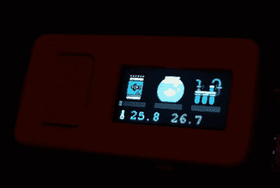

# 当你不在的时候，喂鱼器会一直喂你的鱼

> 原文：<https://hackaday.com/2022/08/04/the-fishfeeder-keeps-your-fish-fed-while-youre-away/>

随着夏季在北半球全面展开，数百万人外出度假，留下数百万套空房子。由于现代技术，监视那些空房子比以往任何时候都容易:联网摄像头报告可疑活动，窗帘和灯泡等智能家居设备可以从你的度假屋进行操作。如果你有一个水族馆，并想在假期中让你的鱼吃得饱饱的，那么[FoxIS]的[联网自动喂鱼器](https://github.com/itohio/FishFeeder)可能也会派上用场。

该系统的核心是一个 3D 打印的机械装置，它在漏斗中容纳一瓶鱼食，并通过伺服操作的快门分配设定的数量。该伺服系统由 M5StickC 物联网开发套件中的 ESP32 驱动。[FoxIS]想用 TinyGo 做这个项目，不幸的是，由于软件限制，他无法使用 ESP32 的内置 WiFi 系统。因此，他将 M5StickC 连接到一个树莓 Pi，他可以在世界任何地方登录该设备来操作喂食机制或通过 USB 摄像头观看他的水生宠物。

 除了自动化喂食过程，喂鱼系统还通过红外温度计跟踪水族馆的温度，并显示其他维护任务的提醒，如换水或清洗过滤器。一个小小的不便是需要有 Raspberry Pi 来连接互联网，但也许 TinyGo 的未来版本将支持 ESP32 上的 WiFi，并使 FishFeeder 成为一个完全独立的系统。

虽然 3D 打印对于像这样的定制机制来说是一个显而易见的选择，但你也可以用特百惠垃圾桶和钻头制作一个更简单的系统[。如果你喜欢金属加工，你也可以制作](https://hackaday.com/2014/10/14/diy-auto-fish-feeder-feeds-fish-automatically/)[真正精确的喂鱼器](https://hackaday.com/2014/12/08/an-msp430-based-automatic-fish-feeder/)。