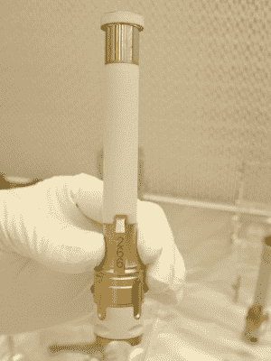
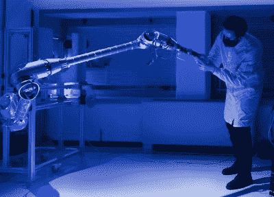

# 火星成功重塑样本返回计划

> 原文：<https://hackaday.com/2022/08/08/martian-successes-reshape-sample-return-plans/>

自从人类向火星发射探测器以来，人们就一直渴望将岩石、土壤和大气样本带回地球进行更详细的分析。但是这种任务的物理学要求特别高——以我们目前的技术，能够在火星表面着陆、收集样本、然后发射回轨道返回地球的飞行器将是巨大的，而且过于昂贵。

Mars sample return tube

相反，美国宇航局和他们的国际合作伙伴一直在努力将这项任务的成本和复杂性分配给几个不同的飞行器。事实上，该计划的第一阶段进展顺利。

自 2021 年 2 月登陆这颗红色星球以来，*毅力*号火星车一直在收集样本并将它们储存在 15 厘米(6 英寸)的钛管中。在[火星登月舱(MAV)上也取得了相当大的进展，它将携带样本从表面](https://hackaday.com/2022/02/14/nasa-taps-lockheed-to-bring-back-a-piece-of-mars/)进入环绕行星的轨道，在那里它们最终将被另一个飞行器拾取，最终将它们返回地球。

但是在整个计划中仍然有一些大的缺口。其中最主要的是如何将样品转移到微型飞行器上。此前，欧洲航天局(ESA)将贡献一个小型“探测车”,它将收集由“坚持号”掉落的样本管，并将它们带到 MAV 发射场。

但是在最近的新闻发布会上，美国国家航空航天局宣布，这些计划已经发生了重大变化，至少部分归功于该机构当前火星任务的惊人成功。

## 可靠的漫游者

最初，美国国家航空航天局建造的样本回收着陆器(SRL)将把微型飞行器和欧空局的漫游车一次性送到火星表面。但是[2020 年，一个独立的审查委员会对这种飞行器的尺寸和质量表示担忧](https://spacenews.com/independent-panel-recommends-delaying-mars-sample-return-missions/)，特别是它将需要开发一种新的未经测试的进入、下降和着陆(EDL)系统。他们认为 MAV 和 ESA 漫游者应该分别着陆，使用为*好奇号*和*坚持号*漫游者开发的 EDL 技术的变体。

取而代之的是，美国国家航空航天局和欧洲航天局已经同意完全删除漫游者，并坚持不懈地将样本送到 SRL 号上。基于*好奇号*的寿命，现在[已经在火星表面度过了十年](https://hackaday.com/2012/08/05/mars-science-laboratory-lands-today/)，有一个极好的机会*坚持号*将在 2031 年 SRL 号预计到达时仍然可以运行。

Testing the Sample Retrieval Lander’s robotic arm.

从局外人的角度来看，这似乎从一开始就应该是计划。毕竟，如果样本已经在一个正常运行的探测器上，你为什么还需要第二个探测器来取回它们呢？但是请记住，当这个计划最初被设计出来的时候，*好奇号*和它的孪生兄弟*恒心号*还没有证明自己。拥有更小、更简单的欧空局 fetch rover 被视为一种合理的预防措施，这样即使*毅力*本身出现故障或卡住，样本也可以被回收。

但是有一个问题。*毅力号*上处理样本管的机械臂缺乏必要的灵活性，无法将它们实际装载到 MAV 中。它能做的最好的事情是将它们丢在离 SRL 足够近的表面上，这样它的[欧空局开发的 2.5 米(8.2 英尺)样品转移臂](https://www.esa.int/Science_Exploration/Human_and_Robotic_Exploration/A_helping_hand_for_Mars)就可以拾起并储存它们。这不会是星际探索历史上最迷人的交接，但为了保持事情简单，还是有一些东西要说的。

## 直升机支援

虽然新计划利用*毅力*作为样本运输的主要手段，但整个任务的成功太重要了，不能不在计划中增加一些冗余。因此，为了取代第二辆漫游车，美国宇航局决定采用一种大胆的方法，这种方法在几年前还被认为是科幻小说:如果*坚持号*无论出于什么原因无法到达 SRL，一对来自[的直升机将试图取回它们，这种设计获得了巨大成功*独创性*](https://hackaday.com/2021/05/02/ingenuity-completes-fourth-flight-on-mars-gets-a-new-mission/) 。

Helicopters based on *Ingenuity* offer a contingency plan.

除了这些新直升机将在着陆腿末端安装轮子和一个能够抓取单个样本管的微型机械臂之外，关于这些新直升机与前代直升机有何不同的信息几乎没有公布。轮子的增加意味着直升机不需要直接降落在管道上，他们只需要足够靠近就可以滚过去。在样本管被从水面上拿起后，直升飞机将把它飞回来，并把它扔到 SRL 旁边。

虽然就其性能和寿命而言,*独创性*已经远远超出了所有人的预期，但对飞机的拟议修改和这项雄心勃勃的新任务提出了新的挑战和风险。派出两架直升机提供了另一层冗余，很可能第二架直升机甚至不会被激活，直到第一架直升机证明了它有能力取回样本，如果出现问题，为任务控制人员提供了宝贵的“重做”机会。

当然，如果*毅力*不需要任何帮助来完成它的任务，你可以肯定美国宇航局将有一些科学上有价值的任务，这对直升机可以自己着手。毕竟，你不会带着硬件跑 1 亿英里去*而不是*使用它。