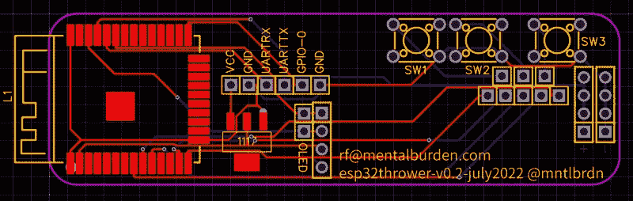

# ESP32 为秘密测试设备供电

> 原文：<https://hackaday.com/2022/08/05/esp32-powers-covert-pentesting-device/>

为了扩展他们的硬件设计经验， [[mentalburden]最近组装了一个低成本的手持小工具](https://mentalburden.medium.com/dropthrowie-your-wifi-friend-5284dabceeaf)，它可以用于各种与安全相关的任务，例如记录 WiFi 流量，作为一个死点运行，以及执行解除认证攻击。

定制 PCB 承载了一些基本组件，包括一个 ESP32-S 微控制器、AMS1117 3.3 V 稳压器、一个 SSD1306 有机发光二极管和几个按钮。这使得用户可以通过简单的菜单系统进行导航，并选择他们希望启用的任何功能。在测试过程中，一对 18650 电池让电子设备运行了令人印象深刻的 22 小时。

PCB 的第二个版本修复了原始原型工作所需的几个插件，鉴于硬件最终的能效如何，[mentalburden]决定将电源降至单个 18650，总运行时间约为 15 小时。一个 3D 打印的外壳和一些硅胶按钮，用一个简单的粘土模具制作而成，完成了包装。

仍然有一些改进可以做，即集成一个电池充电电路到 PCB 和切换到 USB-C，但总的来说，它是一个坚实的原型，令人印象深刻的单位成本不到 10 美元。虽然如果你在寻找更便宜的东西，我们已经看到了基于 ESP-01 的更简单的方法。