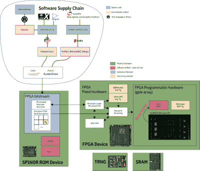

# 以下是前驱如何保护你的隐私

> 原文：<https://hackaday.com/2022/08/06/heres-how-the-precursor-protects-your-privacy/>

在某个时候，你会发现自己在问——我的设备实际上运行了我期望的代码吗？[bunnie]又名[Andrew Huang]热衷于制造你可以从根本上深深信任的设备，他最新的激情项目是 Precursor communicator。

它的核心是一个 FPGA，Precursor 的 CPU 是在 FPGA 的门外创建的。这一点和无数其他设计决策使前身从根本上难以后门，你不必相信[bunnie]的话——他制作了一个完整的视频，介绍前身的架构、启动保护和保证，告诉我们什么是安全设备，也是实用的。

  如果你不能理解你的设备是如何工作的，你对它的信任可能是错误的。在长达一小时的视频中，[bunnie]解释了整个堆栈，从底层硬件到用于签名和验证操作系统完整性的根密钥，同时演示了如何验证事情没有出错。

他一定会指出你需要小心的方面，从物理安全限制到工具链的细微差别。如果你不想看视频，你可以去看看[先驱维基网站](https://github.com/betrusted-io/betrusted-wiki/wiki)，那里有关于设备安全模型的大量信息。

正如你可能已经了解到的，为了值得信赖，硬件开源还不够。尽管开源芯片设计无疑是未来的发展方向，但它们的安全保证[也只能到此为止。](https://hackaday.com/2017/04/25/an-analog-charge-pump-fabrication-time-attack-compromises-a-processor/)

无论是深奥的[硬盘固件后门](https://hackaday.com/2013/12/30/hacking-and-philosophy-surveillance-state/)，将你的 WiFi 卡变成键盘记录器的周末项目[，](https://hackaday.com/2021/07/20/extracting-the-wifi-firmware-and-putting-back-a-keylogger/)还是你可以在商店购买的联想笔记本电脑上获得的[，](https://hackaday.com/2015/02/19/lenovo-shipped-pcs-with-spyware-that-breaks-https/)见鬼，甚至我们本周最新的安全分期中的[都有两个有趣的恶意软件示例——从来不缺少对收集尽可能多的数据感兴趣的各方。](https://hackaday.com/2022/07/29/this-week-in-security-symbiote-smart-locks-and-cosmicstrand/)